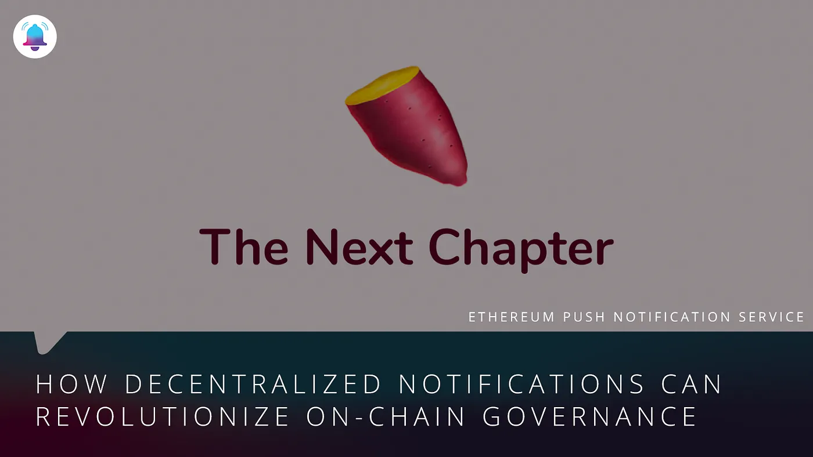
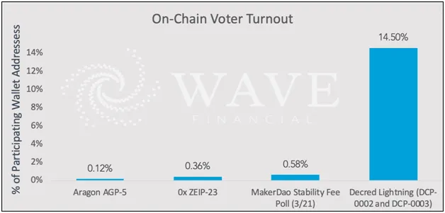
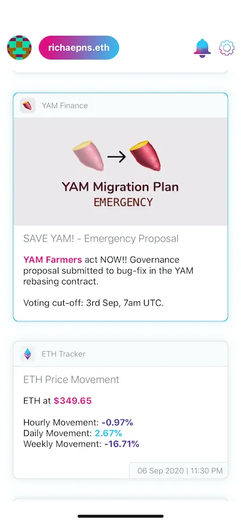

import { ImageText } from '@site/src/css/SharedStyling';

<!--truncate-->

[YAM Finance](https://medium.com/@yamfinance/yam-post-rescue-attempt-update-c9c90c05953f')

_This article is Part 1 of a 2-part series on how EPNS as a service can improve the efficiency of on-chain governance, and hence eventually add to the overall value of the network._

The YAM Protocol may be a familiar term for those who have been following news in the Defi world. But for those who don’t here is a quick run-through.

“Yam is an experimental protocol mashing up some of the most exciting innovations in programmable money and governance. Built by a team of DeFi natives”, it features a fully on-chain governance model to enable decentralized control and evolution from Day 1.

But at 08:01 AM UTC, Aug 13, 2020, the creator of [YAM](https://yam.finance/), tweeted about the failure of rescuing the $750,000 yCRV tokens locked in the governance contract because of a bug in the protocol. YAM was never professionally audited before release, which led to the discovery of the bug after deployment. Hours before that tweet, people in the Ethereum community advocated for a bug-fix-proposal which could have had the chance to **SAVE YAM!**

Interestingly, both the YAM protocol was deployed and the SAVE YAM campaign was both done via a Medium blog post. Although the campaign gained a lot of traction in the Defi community, the rise and fall of YAM have quickly become a cautionary tale within the same community. Here, what we find intriguing (but is common in most blockchain projects) and would like to focus today, is the medium of communication that the YAM developers decided to use when initiating this critical SAVE YAM campaign — Medium (pun totally intended!).

It just seems odd that such a critical announcement that could decide the fate of the protocol was posted on a blog site and a social networking site like Twitter, where stakeholders of the protocol could very much miss if they didn’t pay attention to the series of events that unfolded a few days after the protocol was deployed. This limitation of communication with stakeholders primarily especially when related to on-chain governance is not only restricted to YAM but applies commonly to the whole Blockchain and Web3 based Decentralized community! Protocols and chains often rely on informal social media networking sites such as Twitter, Reddit and Medium to reach their audience, but who accounts for users of the protocol who may want to vote but cannot, just because they missed that tweet? Another issue to point out is also that decentralized Web3.0 protocols currently make use of centralized domains to reach their user base.

It is high time for a reliable and standardized mode of communication to be established between users of a protocol. In this article, we will define what on-chain governance is as well as explain why a standard and unified communication medium between a decentralized protocol or service and their respective user base is needed and how one may go about establishing one. Before diving deeper into this rabbit hole, let’s explain what on-chain governance is.

Off-chain & On-Chain Governance
===============================

Governance in the context of blockchain is a means to facilitate collective decision making. It involves updates and changes that need to be made by the community to the operational rules in order to adapt to a changing world. All blockchains require some form of governance to implement changes on the network. Governance is usually classified into 2 types: on-chain and off-chain governance.

On-Chain Governance operates according to a system of rules that have been encoded directly into the Blockchain framework with the help of smart contracts. Developers propose changes through code updates and each node votes on whether to accept or reject the proposed change.

Off-chain governance is generally implemented outside the blockchain through a system of rules, procedures, and social norms that are not as rigid and formalized as those of a code-based system.

One of the biggest disadvantages and problems faced by governance models which involve on-chain voting is low voter turnout, this is usually linked with miscommunication and voter apathy.

**The Case of Voter Apathy in Blockchain**
==========================================

With On-Chain governance gaining steam and evolving in the past years being considered as a truly decentralized model of governance, more projects with on-chain voting have started to take form. While the importance of different proposals may vary, we can often consider the voter turnout during on-chain voting as a general indicator of community participation in governance.

\*Including voter abstains, Cosmos, Tezos and Decred voter turnout increase to 42%, 72% and 86% respectively. Thanks to [Foreground Capital](https://medium.com/u/ec02790acc52) for consolidating much of this [data](https://docs.google.com/spreadsheets/u/1/d/1Z4UfUJlROl-AMDcC8F6ue6vjubHo9y-nZhOzxM2K79Q/edit#gid=979075578).

With the above chart as reference (form data collected to [Foreground Capital](https://medium.com/u/ec02790acc52)) we can see that the voter turnout with regard to circulating supply is not as high or community involved, as one would expect. If we plot out the number of wallet addresses with respect to the % of circulating supply that takes part in voting, this gap widens, which even makes one wonder, how decentralized is this model if a few rich whales have the power to swing voting results. One of the most obvious ways to make the current system more decentralized is by trying to drive the number of voter turnout higher, especially for critical upgrade proposals.

On-Chain Voter Turnout represented as a % of participating wallet addresses. Note: data is incomplete as participating wallet addresses were difficult to identify.

In his article “[Blockchain Voter Apathy](https://medium.com/wave-financial/blockchain-voter-apathy-69a1570e2af3)”, Roy Learner states that one of the reasons for this low voter turnout could be because of the poor voting infrastructure that exists today. The User experience is extremely flawed. He also states that Subject Matter Expertise could also be a reason, “ Token holders are not always subject matter experts. For example, a casual holder of MKR may not have the economics background required to vote on the implications of an increase or decrease in Maker’s stability fee… Given the time required to truly understand the ramifications of a proposal vote, voter apathy may be higher for more complex proposals. Community leaders can help address this with market education but the average user just may not be willing to devote significant time researching the nuances and implications of a specific proposal.”

One of the main reasons for this — one can deduce — is the lack of a standardized communication medium which informs users of critical voting sessions that take place on-chain. How does a standardized but decentralized communication medium help in reducing voter apathy? It keeps the user base up to date on the state of the network and educates and encourages the casual users along with the expert users to be more involved with the state of the chain as well as the happenings in the community. This makes the users more proactive and more prone to make educated decisions when the time comes to vote. In other words, the gap between the casual and an educated user of the chain will be narrowed significantly.

**EPNS to the Rescue!**
=======================

So far we have talked about the low voter turnout and voter apathy which is often associated with on-chain governance. We also discuss why this all leads to the need for a standardized communication medium needed between the protocol and its users. Enter EPNS- a decentralized push notification protocol built on top of the Ethereum chain. EPNS aims to provide a standard, transparent and efficient communication channel to be established between Web3 services and its users.

Using [EPNS Channels](https://medium.com/ethereum-push-notification-service/a-beginners-guide-to-epns-channels-755cc18bff81), channel owners can send notifications to their subscribers; this feature could be used to help developers create a focal point during critical governance voting processes. Establishing such a decentralized yet efficient connection with the user base not only empowers the Web3.0 space, but also helps in better governance for the chains themselves by keeping their users up to date in community and chain-related matters, and potentially reduce voter apathy.

Let’s take the earlier example of YAM. When the developers found a bug in the YAM protocol, they had to act quickly; they were required to rally as much as 1,600,000 YAM to be delegated in the governance bug-fix proposal to avoid the whole protocol to crash. Although there were other factors that would have made the proposal become unsuccessful when deployed, what we would like to focus here is the medium they used to gather their votes — Twitter and [a Medium article](https://medium.com/@yamfinance/save-yam-245598d81cec).

‘SAVE YAM!’ Campaign Announcement post on Twitter

As mentioned earlier, using social media as a communication medium for such critical and important issues is far from ideal, and in fact, by the proposal did get the threshold votes, it was too little too late. With only about 14.4K followers on their Twitter account, relying on such platforms make it difficult for critical information to be passed through to the consumers.

Now imagine what could have been with the help of **EPNS**.

The YAM core team with EPNS could have sent out a _Broadcast Message_ to all Wallet Addresses with YAM tokens, wherein they specify the bug in the code, as well as direct users to the platform where they could have voted to ensure the timely survival of the protocol. This would have ensured that all users of the protocol would be notified of such a vote taking place, and hence vote almost instantly, thus creating a more efficient and optimized way for On-Chain voting.

Example, use case for YAM Governance voting.

SAVE YAM!!

In this way, EPNS is able to act as a decentralized notification system in order to increase voter turnout, as well as reduce voter apathy, by providing timely and immediate information to users hence allowing casual users to also be better involved in the happenings of the protocol.

**Conclusion**
==============

With the ever-evolving growth of on-chain governance models, comes the issue of voter apathy and low voter turnout which largely undermines the notion of decentralization within the chain since we see that users with more stake only come up to vote on governance-related matters. With EPNS we provide not only a way to establish a better connection for chain developers with the user base, but also allows greater fluidity in the governance of the chain itself. It provides a way to narrow the gap between casual and subject experts when it comes to governance and hence enables the growth of the chain in a way that is purely decentralized.

EPNS not only **_gives_** power back to the people but is also an integral tool **_to give_** that power to the people.

If you like what EPNS is attempting to do by shaking the very foundations of blockchain & decentralized communication, and you would like to follow our journey…

_Consider joining our buzzing Social Media Community!_

> _Telegram:_ [_https://t.me/epnsproject_](https://t.me/epnsproject)
> 
> _Twitter:_ [_https://twitter.com/epnsproject_](https://twitter.com/epnsproject)
> 
> Github_:_ [_https://github.com/ethereum-push-notification-service_](https://github.com/push-protocol/push-website)
