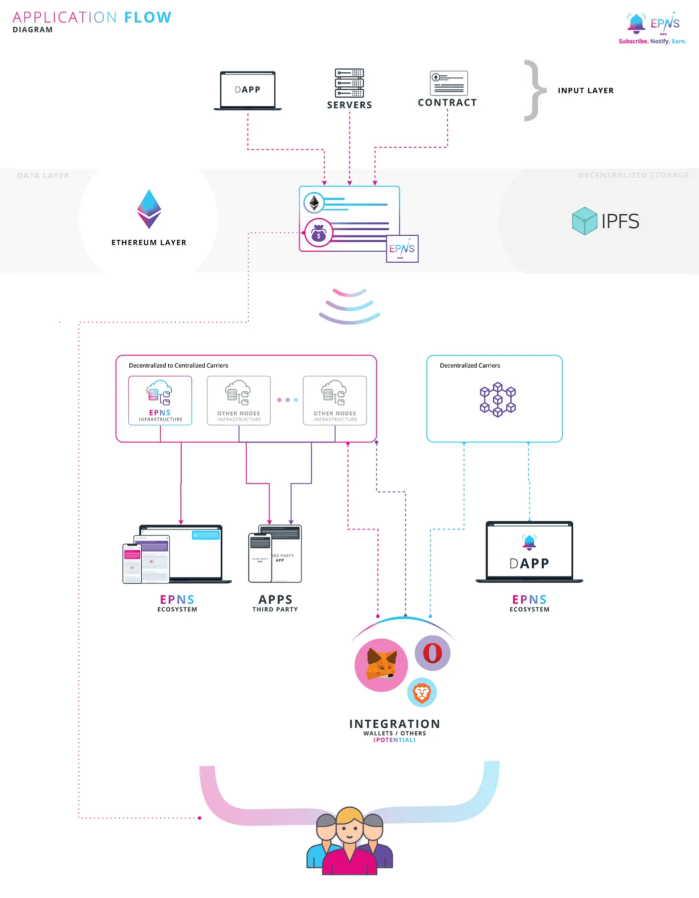
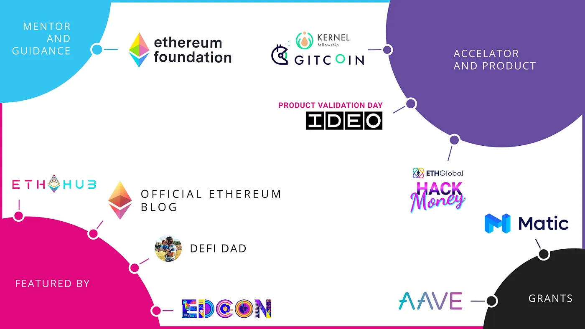

import { ImageText } from '@site/src/css/SharedStyling';

<!--truncate-->

The Ethereum Push Notification Service(EPNS) Litepaper can be also downloaded from [here](https://github.com/ethereum-push-notification-service/epns-whitepaper/blob/master/Ethereum%20Push%20Notification%20Service%20Litepaper.pdf). The content of the Litepaper is included in the article below.

Abstract
========

The document introduces a decentralized notifications protocol that enables wallet addresses to receive notifications in a platform-agnostic fashion from both decentralized and centralized carriers. _Examples of platforms can be dApps, User Wallets, iOS and Android apps, Chrome or Firefox browsers, or any other such platforms._

It also explores and describes the theory and technical aspects of the protocol/platform and the game theory that the protocol utilizes to ensure incentives for good actors in the ecosystem.

The Problem
===========

The blockchain space is growing at an extremely rapid pace and the exponential growth is projected to continue rapidly in terms of users, services, and revenue. Despite this growth, services (dApps, platforms, services, smart contracts) still lack a genuine and decentralized communication medium with their users. Today, communication between provider and consumer often occurs on mediums like email, social media like Twitter, and community platforms like Telegram. These methods defeat the purpose of Web3.0.

Below are quick summaries of pain points that Web3.0 services currently have, and how the lack of a decentralized communication layer results in missing events, actions, and other important updates.

*   On AAVE, Compound, and other DeFi protocols, users don’t learn about their loan liquidations until they manually check, since there is no way for users to receive notifications.
*   Every time a trade order is placed on a DEX, the user is expected to manually check the service or their wallet address to see if the trade is completed or not.
*   ENS domain expiry has to be put on Twitter in the hopes that the grace domain user might read it.
*   Inform users whenever their governance tokens can be used on important proposals, as well as the status and time left for any active governance proposals.
*   Instead of waiting for a tweet, a PoolTogether lottery winner in the future can simply receive their winning lottery via notification.
*   Availability of digital art on a decentralized marketplace or limited edition NFTs can be shared with users by simple notification.
*   Announcements of new protocol feature launch are shared in real-time with users.

These examples highlight a critical pain point in Web3.0 communication, and the problem will only worsen as services and dApps keep growing, especially within DeFi.

**The Solution**
================

Ethereum Push Notification Service (EPNS) is a blockchain protocol that enables services to communicate with its users (wallet addresses) in a decentralized way. The DeFi aspect of the protocol ensures the notifications are incentivized i.e. users will also be receiving token incentives from the notifications.

Furthermore, The decentralized nature of the protocol enables delivery to any centralized or decentralized platforms which paves the way for communication to occur across any platform whether it’s a mobile app, user crypto wallets, web browsers or any other platform that chooses to integrate the protocol.

**EPNS Protocol**
=================

High Level Application Flow
---------------------------

High level application flow

Definitions
-----------

The following definitions are used to refer to certain roles in the ecosystem.

Roles

Description
-----------

EPNS is a notification protocol at its heart. Built on top of Ethereum, It is a fully decentralized middleware layer that enables any dApps, smart contracts, or traditional services to communicate with their users in a privacy-centric (wallet address) and decentralized fashion.

Among other things, the middleware ensures a spam free, user-centric, opt-in, transparent environment for the services and users to communicate.

The protocol also assigns a content type to payloads which essentially means that the services are free to communicate whatever information they want with the users, ie: Sending images, call to actions, videos, or even encrypted transactions. Various examples of payloads and how they operate are further provided in the whitepaper. [**\[**Read in Detail**\]**](https://whitepaper.epns.io/protocol-specs-section/specifications/notification-payload-specs#payload-types)

Protocol Features
-----------------

Incentivized Notifications for Users
------------------------------------

The protocol requires services that want to send notifications to their subscribers to activate themselves by staking $DAI, this **stake** is then **lend** out by protocol to AAVE DeFi protocol (at the time of writing) and starts generating **interest** which is then distributed in a weighted proportion to all the subscribers that have opted in to receive notifications, the weightage rewards the early subscribers a bit more as they become the early adopters. [**\[**Read in Detail**\]**](https://whitepaper.epns.io/protocol-specs-section/epns-protocol/channels/channel-activation-deactivation#game-theory-and-user-incentives)

Platform Agnostic
-----------------

The protocol allows retrievable information (encrypted or plain) of each notification. IPFS stores most of the payload storage, but different storage (decentralized or centralized) are possible in the future for different payload types. This enables universal notification delivery to any crypto wallets, mobile apps, web browsers, dApps, or other platforms as long as they integrate the protocol. As a reward for the integration, the fees paid by the service for these notifications is shared between all wallets and infrastructure providers that enable the delivery of notifications to user wallets. [\[Read in Detail\]](https://whitepaper.epns.io/protocol-specs-section/specifications/notification-payload-specs#notification-json-payload)

Flexible (Arbitrary) Payload
----------------------------

Notification is stored and treated like JSON payload which is transformed as per the rules of the different carriers when the notification reaches them. JSON Payload can differ with payload types which ensures the flexibility of the content, data, storage interpretation, and delivery. This helps in creating different rules and content interpretation of the notification (for example: carrying images, call to action, live videos, etc). [**\[**Read in Detail**\]**](https://whitepaper.epns.io/protocol-specs-section/specifications/notification-payload-specs#notification-json-payload)

User-Centric and opt-in notifications
-------------------------------------

The protocol allows users to be in direct control of what services they get notification from; it imposes rules on the services including spam protection for users, limiting their ability to add wallets as subscribers, etc. [**\[**Read in Detail**\]**](https://whitepaper.epns.io/protocol-specs-section/epns-protocol/subscribers/user-direct-action-subscribe)

Spam score and throttling
-------------------------

Each channel has a spam score that ranges from 0–1. Value of 0 means the channel has an excellent score and 1 means the channel is very unhealthy. The range adjusts based on positive actions such as a higher number of subscribers, with the passing of time while negative actions are higher than usual unsubscribers, higher than usual notifications, etc. This is guided by the protocol and at a certain range, the protocol will start throttling the notifications or even stop them until the score comes back to a healthier range. [\[Read in Detail\]](https://whitepaper.epns.io/protocol-specs-section/epns-protocol/channels/spam-rating-and-throttling)

Governance
----------

The protocol governance is designed to incentivize continued adoption of the EPNS protocol. This is achieved by ensuring incentives for all the users involved by rewarding or encouraging them through incentives and penalty, their continued involvement is seen to be necessary for the growth and adoption of the protocol and to achieve the **vision of becoming a web3 notification standard**. The EPNS user are categorized as **Service Providers, Subscribers, Wallet / Infra Services, and Governance Users**, all of them are rewarded for their involvement and to ensure that they keep other parties in check for a healthy ecosystem according to the game theory described in the whitepaper. [**\[**Read in Detail**\]**](https://whitepaper.epns.io/governance-section/governance/game-theory)

**EPNS Product**
================

In order to facilitate the adoption of the protocol and to provide value to services, we are also building a product suite of EPNS to catalyze the adoption and growth. These currently include developing:

*   **EPNS Mobile App** — Serves the purpose of delivering notifications from decentralized protocol to centralized EPNS Infra to centralized platforms (iOS and Android).
*   **dApp** — Enables receiving notifications from web browsers and also enables delivery of notifications from protocol to decentralized carriers.
*   **EPNS Infra (Push Service)** — Enables carrying notifications from decentralized protocol to centralized solutions (iOS, Android, Web, etc). Also enables third-party dApps, services, and protocols to start experiencing the notification impact as notifications are delivered following the entire protocol/product lifecycle.
*   **Showrunners** -These are channels created and run by us for the benefit of the community and for users to come and see why push notifications transformed the traditional world. Few examples of showrunners which we will be running are -: Compound liquidation alert, Wallet crypto movement tracker, Eth Gas alerter, ENS domain expiry, etc.
*   **JS Library** — Considerably reduces the integration time required for third party dApps, servers. We see these products to enable instant value add to the protocol and help in increasing awareness and eventually drive the adoption of the protocol.
*   **Future Features —** There are some future features including decentralized video that is getting discussed and explored as well, you can read a brief synopsis of them over here. [**\[**Read in Detail**\]**](https://whitepaper.epns.io/protocol-specs-section/future-features-research)

**Governance**
==============

The native digital cryptographically - secured utility token of the EPNS protocol (**$PUSH**) is a transferable representation of attributed functions specified in the protocol/code of the EPNS protocol, which is designed to play a major role in the functioning of the ecosystem on the EPNS protocol and intended to be used solely as the primary utility token on the network.

**$PUSH** tokens are used to control various core functionalities of the EPNS protocol, allowing users to vote on features of the protocol. For the avoidance of doubt, the right to vote is restricted solely to voting on features of the EPNS protocol; the right to vote does not entitle $PUSH holders to vote on the operation and management of the Company, the Distributor or their respective affiliates, or their assets, and does not constitute any equity interest in any of the aforementioned entities. For example, the protocol fees are charged in **$ETH** or **$DAI** within the EPNS protocol, but the $PUSH token holders may vote to change these fee parameters. [**\[**Read in Detail**\]**](https://whitepaper.epns.io/governance-section/governance/usage-and-design)

Achievements
============

Authors: Harsh Rajat, Richa Joshi

Litepaper Version 1.0 | October 2020

Ethereum Push Notification Service [Whitepaper](https://whitepaper.epns.io/)

Draft for community review and subject to change

Become part of our buzzing community! Join the conversation on one of our channels:  
[Twitter](https://twitter.com/epnsproject) | [Telegram](https://t.me/epnsproject)
