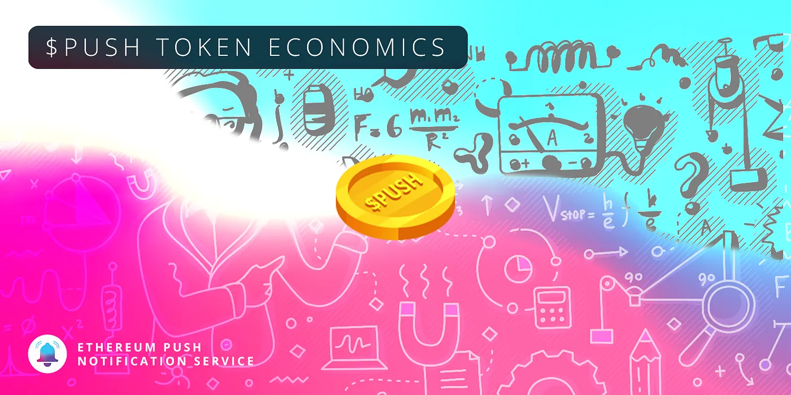

import { ImageText } from '@site/src/css/SharedStyling';

<!--truncate-->

> **Update:** Push Protocol (Previously EPNS) and $PUSH is evolving, The evolved version of Pusheconomics can be found here: [https://docs.push.org/pusheconomics/push-token-economics](https://docs.push.org/pusheconomics/push-token-economics)

Ethereum Push Notification Service (EPNS) is a protocol for decentralized notifications on the Ethereum blockchain. EPNS enables applications and users to create and subscribe to notification channels, enabling blockchain-native communication between apps and users. The Web3 ecosystem today communicates through channels like email, Medium, Twitter, Discord, WeChat, and more. For rapidly-evolving use cases like DeFi, these forms of communication struggle to scale. EPNS protocol lets applications send push notifications to users regarding updates, account information, product drops, and more. Users can also set up custom notifications in response to on-chain events to better monitor investments, transactions, app security, protocol performance, and more.

$PUSH is the native governance token of the EPNS protocol. PUSH provides its holders with two primary benefits: **governance rights** and **reward accrual**. Following the network token generation event, PUSH holders will be able to participate in the evolution of the EPNS protocol and earn rewards from the fees paid to the network.

**Reward Accrual**
==================

The EPNS platform consists of _services, channels,_ and _subscribers._ Services are dapps or smart contracts that wish to send notifications. Services set up _channels_ that send notifications when certain events happen or parameters are met. _Subscribers_ are the users that sign up to those channels and elect to receive notifications.

When services set up a channel, they must deposit at least 50 DAI into a common staking pool. The common staking pool is an aggregation of the fees from all channels across the EPNS protocol. The common staking pool is then staked in AAVE (at the time of launch), where it accrues value. Accrued DAI is distributed to subscribers of EPNS channels in proportion to how early they joined. Fees are implemented when services close channels, to disincentivize gaming.

The EPNS protocol also has the _fee pool,_ which is tied to $PUSH ownership. The fee pool is a collection of micro-payments paid by services either in a per-notification or yearly subscription model. Fees are paid in DAI or ETH, and collected in the fee pool. The fee pool is distributed to the community. 70% goes to $PUSH holders and 30% goes to the ecosystem development fund. The fee pool will not be live with mainnet launch, and will be activated within a year or so following the protocol’s launch.

**Governance Rights**
=====================

$PUSH also gives owners the right to vote on protocol decisions, including the staking structure, staking mechanism, and reward distribution rates. Governance votes can include the structure of the fees paid by services (i.e. per notification or yearly subscription), the DeFi mechanism for the staking pool (i.e. staking through AAVE or elsewhere), and other critical incentivization and financial elements of the protocol.

Learn more about EPNS and $PUSH in our [whitepaper](https://whitepaper.epns.io/).

> Update: Token Generation Event Announced! Read about $PUSH token allocation and plan [here](https://medium.com/ethereum-push-notification-service/announcing-the-epns-push-token-generation-event-4d1699e716f5).
