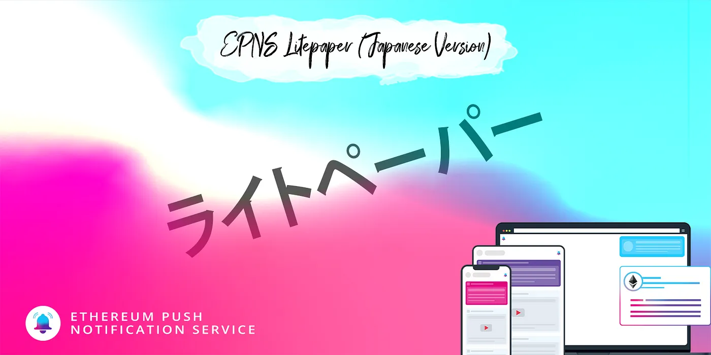
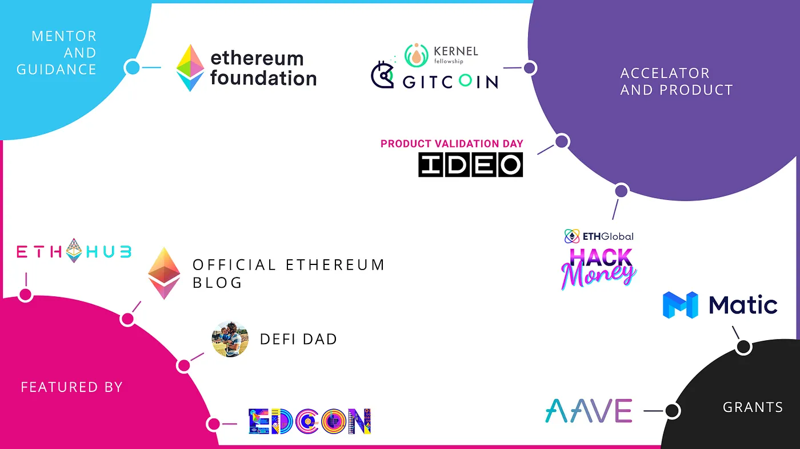

import { ImageText } from '@site/src/css/SharedStyling';

<!--truncate-->

# 概要

本文書では、ウォレットアドレスが、分散型キャリアと中央集権型キャリアの両方からの通知を、プラットフォームに依存しない方法で受信できるようにする分散型通知プロトコルを紹介します。プラットフォームの例としては、dApps、ユーザウォレット、iOSおよびAndroidアプリ、ChromeまたはFirefoxブラウザ、または他の任意のそのようなプラットフォームを挙げることができます。

また、プロトコル/プラットフォームの理論と技術的側面、プロトコルがエコシステム内の善良なアクターのインセンティブを確保するために利用するゲーム理論についても探り、説明します。

# 問題点

ブロックチェーン空間は非常に急速なペースで成長しており、ユーザー、サービス、収益の面で指数関数的な成長は今後も急速に続くと予測されています。このような成長にもかかわらず、サービス（dApps、プラットフォーム、サービス、スマートコントラクト）には、ユーザーとの真の分散化されたコミュニケーション媒体がまだ不足しています。今日、プロバイダと消費者の間のコミュニケーションは、電子メール、Twitterのようなソーシャルメディア、Telegramのようなコミュニティプラットフォームのような媒体で行われることが多い。これらの方法では、Web3.0の目的は達成されません。

以下は、Web3.0サービスが現在抱えている問題点と、分散化されたコミュニケーション層の欠如が、イベントやアクション、その他の重要な更新を逃す結果となっていることを簡単にまとめたものです。

- AAVE、Compound、および他の DeFi プロトコルでは、ユーザーが通知を受け取る方法がないため、ユーザーは手動で確認するまでローンの清算について知らないままである
- DEX に取引注文が発注されるたびに、取引が完了したかどうかを手動でサービスやウォレットアドレスで確認する必要がある
- ENS ドメインの期限切れは、グレースドメインのユーザーが読んでくれることを期待して Twitter に掲載しなければならない
- ガバナンストークンが重要な提案に使えるようになったら、いつでもユーザーに通知する機能がない
- ツイートを待つのではなく、将来的にPoolTogetherの宝くじの当選者は、通知を介して当選した宝くじを受け取ることができない
- 分散型マーケットプレイスでのデジタルアートの利用可能性や限定版のNFTは、簡単な通知でユーザーに共有することができない
- 新プロトコル機能の発表をユーザーと共有できない

これらの例は、Web3.0コミュニケーションにおける重要な問題点を浮き彫りにしており、特にDeFi内でのサービスやdAppの成長に伴い、問題は悪化するばかりです。

# 解決策

Ethereum Push Notification Service（EPNS）は、ブロックチェーンプロトコルで、サービスが、分散型の方法でユーザー（ウォレットアドレス）と通信することを可能にします。DeFiの側面として、このプロトコルは、通知がインセンティブになることを可能にします。つまりユーザは通知からトークンを取得することができます。

さらに、プロトコルの分散化された性質により、モバイルアプリ、ユーザーのウォレット、ウェブブラウザ、その他どのプラットフォームに渡って、すべての中央集権型または分散型のコミュニケーション方法を向上させたいプラットフォームが利用することができます。

# EPNS Protocol

アプリケーションのフロー

# 定義

エコシステムにおける特定の役割については、以下のような定義があります。

# 説明

EPNSは、その中心にある通知プロトコルです。Ethereumの上に構築され、それは完全に分散化されたミドルウェア層であり、任意のdApps、スマートコントラクト、または従来のサービスがプライバシー重視（ウォレットアドレス）と分散化された方法で、ユーザーと通信することを可能にします。

とりわけ、このミドルウェアは、サービスとユーザーが通信するためのスパムフリー、ユーザー中心、オプトイン、透明な環境を保証します。

プロトコルはまた、ペイロードにコンテンツタイプを割り当てます。これは基本的に、サービスがユーザーと通信したい情報を自由に通信できることを意味します。ペイロードの様々な例とそれらがどのように動作するかについては、ホワイトペーパーで詳しく説明しています。\[[詳細を読む](https://whitepaper.epns.io/protocol-specs-section/specifications/notification-payload-specs#payload-types)\]

# プロトコルの機能

# ユーザーのためのインセンティブ通知

プロトコルは、サービスがアクティベートし、そのサービスの加入者に通知を送信するために、$DAI のステーキングを要求します。この**ステーク**は、その後、AAVEなどのDeFiプロトコル（執筆時）によって**貸し出され**、通知を受信することを選択しているすべての加入者に重み付けされた割合で配布される**金利**を生成し始めます。そして重み付けによってアーリーアダプターである初期の加入者に多くの報酬を与えます。\[[詳細を読む](https://whitepaper.epns.io/protocol-specs-section/epns-protocol/channels/channel-activation-deactivation#game-theory-and-user-incentives)\]

# プラットフォームにとらわれない

プロトコルでは、各通知の取得可能な情報(暗号化またはプレーン)を可能にします。IPFSはペイロードのストレージの大部分を格納しますが、将来的には異なるペイロードタイプに対して異なるストレージ（分散型または中央集権型）が可能になります。これにより、プロトコルを統合する限り、あらゆるクリプトウォレット、モバイルアプリ、ウェブブラウザ、dApps、または他のプラットフォームへの普遍的な通知配信が可能になります。統合の報酬として、これらの通知のためにサービスが支払う手数料は、すべてのウォレットと、ユーザーウォレットへの通知の配信を可能にするインフラストラクチャプロバイダの間で共有されます。\[[詳細を読む](https://whitepaper.epns.io/protocol-specs-section/specifications/notification-payload-specs#notification-json-payload)\]

# 柔軟な（任意の）ペイロード

通知は保存され、通知が異なるキャリアに到達したときに、異なるキャリアのルールに従って変換されるJSONペイロードのように扱われます。JSONペイロードは、コンテンツ、データ、ストレージの解釈、配信の柔軟性を保証するペイロードタイプと異なることができます。これは、通知の異なるルールとコンテンツの解釈を作成するのに役立ちます（例：画像、コールトゥアクション、ライブビデオなど）。\[[詳細を読む](https://whitepaper.epns.io/protocol-specs-section/specifications/notification-payload-specs#notification-json-payload)\]

# ユーザー中心の通知とオプトイン通知

このプロトコルは、ユーザーがどのサービスから通知を受けるかを直接制御できるようにし、ユーザーのためのスパム保護、加入者としてウォレットを追加する能力の制限など、サービスにルールを課します。\[[詳細を読む](https://whitepaper.epns.io/protocol-specs-section/epns-protocol/subscribers/user-direct-action-subscribe)\]

各チャンネルには、0から1までの範囲のスパムスコアがあります。値が0の場合は、そのチャンネルが優れたスコアを持っていることを意味し、1の場合は非常に不健全なチャンネルであることを意味します。範囲は、時間の経過とともに購読者数が増えるなどのポジティブなアクションに基づいて調整されますが、ネガティブなアクションは、通常よりも高い購読解除者数、通常よりも高い通知などです。これはプロトコルによって誘導され、一定の範囲になると、プロトコルは通知のスロットリングを開始したり、スコアが健全な範囲に戻るまで通知を停止したりします。 \[[詳細を読む](https://whitepaper.epns.io/protocol-specs-section/epns-protocol/channels/spam-rating-and-throttling)\]

# ガバナンス

プロトコルのガバナンスは、EPNSプロトコルの継続的なアダプションを促すように設計されています。これは、インセンティブとペナルティを通じて、報酬もしくは動機づけすることにより、関与するすべてのユーザーのためのインセンティブを確保することによって達成されます。これらの継続的な関与は、プロトコルの成長と採用に必要であり、\*\*Web3通知標準になるというビジョンを達成するために必要であると考えられています。\*\*EPNSのユーザーは、**サービスプロバイダ、サブスクライバ、ウォレット/インフラサービス、ガバナンスユーザー**に分類され、それらのすべてが、ホワイトペーパーに記載されているゲーム理論に従って、健全なエコシステムのために他の当事者を牽制し続けることを保証するために、関与に報酬を与えられています。\[[詳細を読む](https://whitepaper.epns.io/governance-section/governance/game-theory)\]

# EPNS プロダクト

プロトコルの採用を促進し、サービスに価値を提供するために、当社はまた、採用と成長を促進するためにEPNSの製品群を構築しています。現在、これらには以下の開発が含まれています。

- **EPNSモバイルアプリ** — 中央集権型プラットフォーム（iOSとAndroid）に分散型プロトコルから中央集権型EPNSインフラへの通知を配信する目的で機能します。
- **dApp** — ウェブブラウザからの通知の受信を可能にし、プロトコルから分散型キャリアへの通知の配信を可能にします。
- **EPNS Infra (Push Service)** — 分散型プロトコルから集中型ソリューション（iOS、Android、Webなど）への通知の配信を可能にします。また、サードパーティの dApps、サービス、プロトコルは、プロトコル/製品のライフサイクル全体に沿って通知が配信されるため、通知の影響を経験することができます。
- **ショーランナー** — これらは、コミュニティの利益のために、また、プッシュ通知が従来の世界を変革した理由をユーザーが見に来るために、私たちによって作成され、実行されるチャンネルです。我々が実行する予定のショーランナーのいくつかの例は、次のとおりです。Compoundの清算アラート、ウォレットの値動きトラッカー、ETH ガスアラート、ENSドメインの有効期限切れなど。
- **JSライブラリ** — サードパーティのdApps、サーバーに必要な統合時間を大幅に短縮します。これらの製品は、プロトコルに即座に付加価値を与えることができ、認知度を高め、最終的にはプロトコルの採用を促進するのに役立つと考えています。
- **将来の機能** — 議論され、検討されている分散型ビデオを含むいくつかの将来の機能があります。\[[詳細を読む](https://whitepaper.epns.io/protocol-specs-section/future-features-research)\]

# ガバナンス

EPNSプロトコルのネイティブ・デジタル暗号で保護されたユーティリティ・トークン（**$PUSH**）は、EPNSプロトコルのプロトコル/コードで指定された帰属機能の転送可能な表現であり、EPNSプロトコル上のエコシステムの機能において主要な役割を果たすように設計されており、ネットワーク上の主要なユーティリティ・トークンとしてのみ使用されることが意図されています。

**$PUSH** トークンは、EPNSプロトコルの様々なコア機能を制御するために使用され、ユーザーがプロトコルの機能に投票することを可能にします。疑義を避けるために、投票権は、EPNSプロトコルの機能に関する投票のみに限定されています。投票権は、$PUSH保有者に、当社、配布者、またはそれらの関連会社の運営・管理、またはそれらの資産に関する投票権を与えるものではなく、また、前述の事業体の持分を構成するものでもありません。例えば、EPNSプロトコル内では、プロトコル料金は **$ETH** または **$DAI** で課金されますが、$PUSHトークン保有者はこれらの料金パラメータを変更するために投票することができます。\[[詳細を読む](https://medium.com/ethereum-push-notification-service/push-token-economics-d7f566c29b1a)\]

# マイルストーン

# 現在

- 実証実験✅
- DeFiインセンティブ＆ゲーム理論✅
- モバイルのプッシュ通知✅
- ROPSTEN上のα版ローンチ✅
- プロトコル・プロダクト改善🛠

# 将来

- 開発者ツールキット
- L2＆プロトコル最適化
- Web通知＆Dappインターフェース
- コード監査とメインネット
- 統合とさらなる改良

# 達成事項

> Huge shoutout and thanks to [@CoffeeTimesTW](https://twitter.com/CoffeeTimesTW) Kaito for helping with translation of the Litepaper!!
