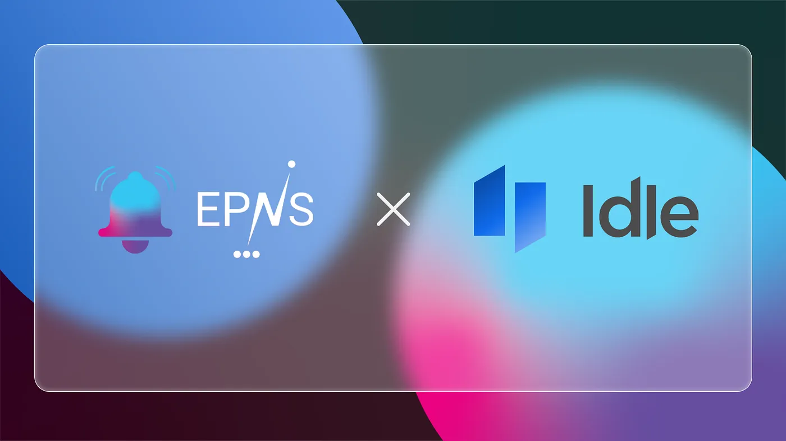

import { ImageText } from '@site/src/css/SharedStyling';

<!--truncate-->

For blockchain networks and blockchain-based projects, on-chain governance is crucial for managing and implementing changes. But, to execute it well, it requires all network participants to come to a consensus about building, updating or abandoning certain rules and processes within the ecosystem.

This can be particularly challenging if there is no communication channel that brings all the participants together and keeps them updated about the changes being made. That’s why we’ve partnered with [Idle](https://idle.finance/) to deliver push notifications for their governance-related proposals and updates, building unprecedented levels of communication between the participants and the network.

# How Can Idle Benefit from Push Notifications

Idle is a blockchain-based rebalancing protocol that allows users to manage their digital asset allocation across third-party DeFi protocols. To adapt to the ever-changing trends in the crypto space while keeping the protocol decentralized and community-driven, Idle relies on its community to make governance proposals to update its protocol and processes.

In this context, whenever there are new proposals made to update the protocol or processes of Idle, stakeholders need to be notified about the voting process. The community too needs to be updated about the changes they can expect to unfold within the network. Without a proper communication channel, all these participants solely rely on Twitter, Telegram, and other third-party media for updates, which creates friction between them and the network, ultimately lowering participation rates.

This is where Idle’s collaboration with EPNS could be game-changing: decentralized push notifications provide a reliable medium for the network to effectively deliver timely updates about network governance proposals to the community members.

# What Does the Partnership Entail

Through our collaboration with Idle, we aim to build a reliable communication medium for stakeholders and the community to actively drive the protocol in a direction that best suits them. Users can now subscribe to receive push notifications pertaining to Idle’s governance updates directly on their mobile devices. They can also expect:

- Information about all the new governance proposals made on the Idle network.
- Updates about the voting process with actionable links that encourage participation for stakeholders.
- Updates on the decisions made through the voting process for the community.
- Information about implementing the changes and the future of the Idle network.

As Idle works towards rebalancing assets and maximizing interest rates and yield for its users, we are delighted to collaborate with them to ease their on-chain governance process and take another important step toward building a decentralized communication layer for web 3.0.

# About Idle

Idle is a decentralized rebalancing protocol that allows users to automatically and algorithmically manage their digital asset allocation among different third-party DeFi protocols. You can choose to maximize your interest rate returns through the Best-Yield strategy or minimize your risk exposure through the Risk-Adjusted strategy.

Idle operates under a DAO governance model with the Idle Leagues formed as sub-DAOs. All individual contributors are voted in by the Idle token holders. More information about the Idle governance structure can be found [here](https://developers.idle.finance/governance/governance).

Stay in touch! [Website](https://idle.finance/#/) | [Twitter](https://twitter.com/idlefinance) | [Telegram](https://t.me/idlefinance) | [Medium](https://idlefinance.medium.com/) | [Discord](https://discord.com/invite/mpySAJp)
