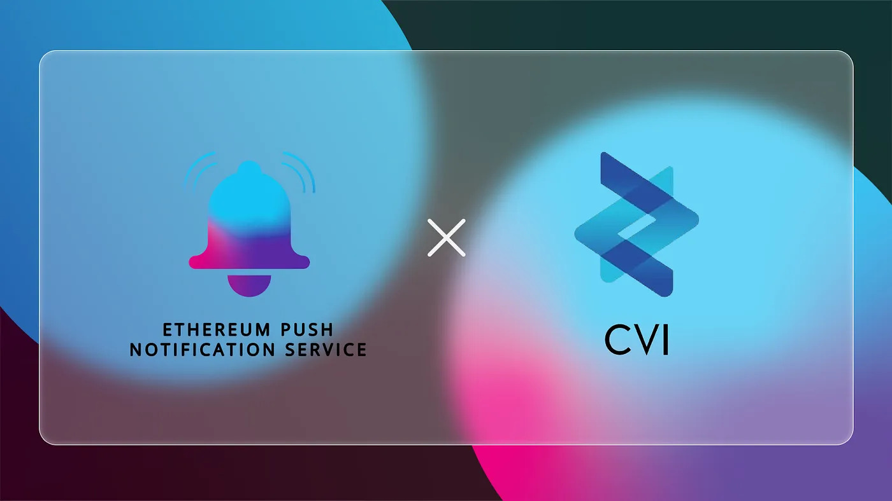

import { ImageText } from '@site/src/css/SharedStyling';

<!--truncate-->

The crypto market among all other things is known for its volatility. Just a look at the charts of the past few months can tell what a wild ride it has been for investors across the globe. While some of them have made millions, others have lost a lot due to the high volatility.

As of now, there seems to be no way to circumvent this volatility, so the best option is to capitalize on it? COTI, the world’s first enterprise grade fintech platform aims to do just that. With its decentralized crypto volatility index (CVI), it lets users capitalize on market fluctuations in either direction. Combine this with our decentralized push notifications that help users maximize their profits and we get a partnership to keep.

Better Opportunities, Better Engagement with Push Notifications
===============================================================

COTI’s CVI, as mentioned before, is the first ever decentralized volatility index (CVI) inspired by the traditional stock market VIX. Users can profit from volatility by opening positions in expectation of fluctuations in either direction. The index has a value ranging from zero to 200 calculated by analyzing the implied volatility of cryptocurrency option prices together with analyzing the market’s expectation of future volatility.

Users who believe the volatility is on the rise can open CVI positions and rake profits by selling their positions once the index rises. On the other hand, users who believe the volatility will remain low, can provide liquidity to the platform and benefit from fees paid by users who opened CVI positions.

In reference to this, users have to continuously keep an eye on third party communication channels like mail and Twitter to be able to fully capitalize on these fluctuations. Failure to do so might result in missed opportunities for users and poor engagement for the platform.

This is where EPNS push notification could be a significant addition. By providing timely updates, EPNS can reduce users’ dependency on third-party media and ensure that they miss no opportunity.

What Does the Partnership Have in store
=======================================

Through our partnership with CVI, we aim to build a robust communication medium that encourages user participation on the CVI protocol. Users can subscribe to receive timely notifications about the market situation, which include

*   Updates about unexpected changes in index value for all users.
*   Updates about upcoming market events like Coinbase IPO, EIP 1559 that could affect the CVI.
*   Updates to individual users about their margin positions on the platform if they approach liquidation threshold.
*   Updates on arbitrage opportunities specifically for CVI arbitrageurs group.

These notifications can better help users anticipate where the market is going, pre-plan their strategies, and maximize their profits. We’re pleased to be partnering with CVI on this project and are hopeful that EPNS push notifications will become an integral part of the Crypto Volatility Index.

To get more updates about EPNS and the exciting partnerships we form, stay tuned!

About COTI
==========

COTI is a fully encompassing “Finance on the blockchain” ecosystem, specifically designed to meet the challenges of both centralized finance (fees, latency, global inclusion and risk) and Decentralized Finance DeFi (fees, clogging and complexity) by introducing a new type of DAG based base protocol and infrastructure that is scalable, fast, private, inclusive, low cost and is optimized for finance.

Stay in touch! [Website](https://coti.io) | [Telegram](https://t.me/COTInetwork) | [Twitter](https://twitter.com/COTInetwork) | [Github](https://github.com/coti-io) | [Whitepaper](https://coti.io/files/COTI-technical-whitepaper.pdf)

About CVI (Crypto Volatility Index)
===================================

The Crypto Volatility Index (CVI) is a VIX for crypto, created by the COTI team and Prof. Dan Galai, the creator of the original VIX, in order to create a “market fear index” for the crypto market. CVI is a protocol tracking the 30-day implied volatility of Bitcoin and Ethereum. The index ranges between 0 and 200 and is produced based on a Black-Scholes option pricing model, which computes the implied volatility of cryptocurrency option prices together with analyzing the market’s expectation of future volatility. Using the index, people can have the same insights of the market that people that look into traditional markets have using the VIX: understand the expected volatility of the market, develop trading strategies for short-term gains, and hedge their portfolio against price fluctuations.

Stay in touch! [Website](https://cvi.finance/) | [Telegram](https://t.me/cviofficial) | [Twitter](https://twitter.com/official_CVI) | [Github](https://github.com/coti-io/cvi-contracts) | [Whitepaper](https://cvi.finance/files/cvi-white-paper.pdf)

