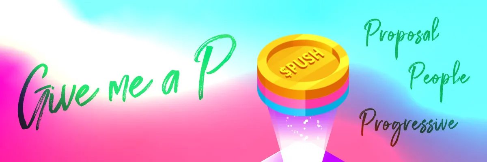
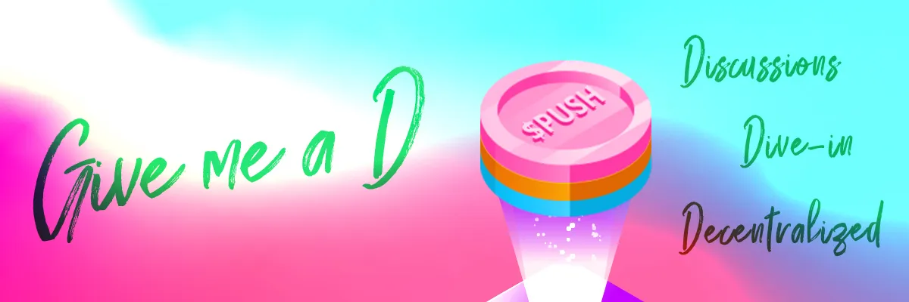
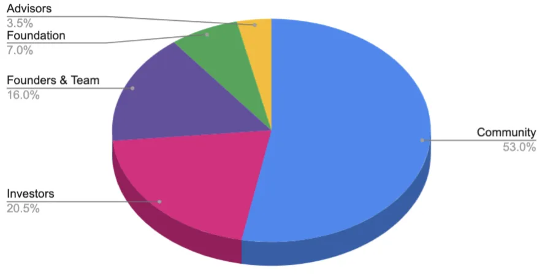

import { ImageText } from '@site/src/css/SharedStyling';

<!--truncate-->

*   $PUSH contract address: 0xf418588522d5dd018b425E472991E52EBBeEEEEE
*   53% of $PUSH supply is for community allocation
*   $PUSH is available through [exchanges](https://epns.io/), [liquidity mining and staking initiatives](https://incentives.epns.io/)

TL;DR What’s Happening
======================

Today, EPNS is launching our governance framework along a roadmap of Progressive Decentralized Governance. Governance launches on September 16, and nominations for [PUSH Delegatees are open!](https://gov.epns.io/t/epns-push-delegatee-nominations/21)

EPNS Governance will launch with three ways for the community to vote and be involved: 1) Grants Program, 2) Weekly Rockstar NFT, and 3) Metagovernance.

There are 4 roles within EPNS Governance:

1.  PUSH Nominee: community members who can be delegated $PUSH to vote on proposals.
2.  PUSH Delegatee: nominees who have 75,000+ $PUSH delegated, and can create new proposals.
3.  PUSH Delegator: $PUSH token holders who can vote and/or delegate tokens.
4.  PUSH Champions: individuals from across the ecosystem who help champion the EPNS governance framework and keep the community updated.

Introducing Progressive Decentralized Governance for EPNS
=========================================================

The EPNS community is fundamental to the network’s success. By launching the Progressive Decentralized Governance infrastructure, we now take another step towards greater community participation. For us, it’s a thrilling experience. For the community, it’s the introduction of the necessary toolkit for discussing and organizing the protocol’s future.

EPNS has grown exponentially since the launch of the [$PUSH token](https://medium.com/ethereum-push-notification-service/announcing-the-epns-push-token-generation-event-4d1699e716f5) in April, particularly concerning community engagement. **Over 5,400 addresses** have already subscribed to EPNS channels, and currently, there are **over 3,600 on-chain token holders**.

Following our Token Genesis, we implemented several [community incentivization](http://incentives.epns.io/) programs, including liquidity mining and staking initiatives. During this phase, we also launched the [$ROCKSTAR EPNS NFT](https://medium.com/ethereum-push-notification-service/kicking-off-the-epns-nft-community-drops-6a5c49808cf), while activating the $PUSH rewards mechanism to express gratitude to our early adopters.

Implementing EPNS Governance marks the protocol’s next milestone, as we gradually move towards complete decentralization of the decision-making process. In this first iteration of the governance mechanism, we will use Snapshot, which is an off-chain and gasless multi-governance client. Due to its Snapshot-based implementation, the voting mechanism shall be weighted based on the number of $PUSH tokens delegated to the voting address. Hereafter, any potential modifications to the protocol must pass through a proposal and voting process.

EPNS Governance Phase 0
=======================

When EPNS Governance launches on September 16, the community will be able to vote and make proposals on the following topics:

*   **Grants Program:** allocating grants to teams, projects, and initiatives across the ecosystem that are helping build around the EPNS ecosystem. The grants funds will come from the $PUSH Community Allocation (see below ‘PUSH Allocation’).
*   **Weekly Rockstar NFTs:** each week, one EPNS community member is airdropped an NFT based on their contributions to the ecosystem. Voting for the recipient will now be part of the governance process.\*\*
*   **Meta-Governance:** token holders can pass and vote on measures affecting how EPNS governance evolves past phase 0.

As the protocol matures, EPNS Governance will further decentralize and include more categories giving the community more power over the protocol!

Proposals to go live from 16th September! [PUSH Delegatee Nominations](https://gov.epns.io/t/epns-push-delegatee-nominations/21) are open now.

\*\*The governance process for Rockstar NFTs will follow a slightly accelerated process, to ensure community members are rewarded quickly! The process will skip the “Proposal” portion, and go straight to Snapshot. Team Champions will nominate 4 Rockstars from the past week, and the $PUSH community will vote for their top choice in Snapshot. For more information about Team Champions and the governance process, see below.

Governance Roles
================

There are four main roles in EPNS Governance:

*   **PUSH Nominee:** Active community members who strongly support the vision of EPNS can nominate themselves to be a PUSH Nominee. $PUSH token holders can then choose to delegate their voting rights to any Push Nominee, who can vote on governance proposals through Snapshot. Nominations are now open — [see here](https://gov.epns.io/t/epns-delegatees-introduction/21).
*   **PUSH Delegatee:** PUSH Delegatees are active members of the community who have at least 75,000 $PUSH delegated to them. They will be able to create proposals on Snapshot that are approved on the forum.
*   **PUSH Holders:** $PUSH holders can delegate their voting power to anyone, including themselves. They can also delegate it to a PUSH Delegatee to ensure their views and thoughts are well represented. The PUSH Delegatee can be changed at any time\*\*.
*   **PUSH Champions:** A key part of our decentralization is making sure the community feels empowered. PUSH Champions are active community members that provide support to the EPNS metagovernance in various ways. There are 3 categories of PUSH Champions.

_Community Champions: Web3 leaders who support the visions of EPNS and are willing to educate and empower the community to carry out progressive decentralized governance._

_Team Champions: EPNS team members who are dedicated to guide and assist the community to implement a fair governance procedure._

_Elected Champions: Elected community members who are trusted with the duty to assist the community to carry out a smooth governance process during each stage of a proposal. More details about the elected champions including selection, election and incentives will be made available soon. Ideally, we will select the first batch by again floating a proposal so that people can join in. We will explore compensation opportunities for these champions._

_Note: No rewards or incentives are in place for Community Champions and Team Champions for the time being. Incentives will only be available for Elected Champions of the community._

**_\*_ Users who don’t hold $PUSH but are highly motivated to participate and partake in the future of the protocol. They are also able to play a role in the ecosystem with the only condition being lobbying a Delegatee to back them up at the final stage of the voting.**

Governance Process
==================

1\. Proposal Phase — [gov.epns.io](http://gov.epns.io/)
-------------------------------------------------------

This is the very start of the entire governance journey. For any proposal to be accepted and executed for EPNS Governance, the initial proposer needs to submit their proposal on the [Governance Proposal](https://gov.epns.io/c/governance-proposals/8) Forum with the rules mentioned below.

Note: This is a Discourse-hosted forum for governance-related discussion. Community members must register for an account before participating. Proposals on the forum must be submitted following a template.

**How to submit a Draft Proposals**

*   Users need to [follow this template](https://github.com/push-protocol/push-website/governance/blob/main/draft-proposal-template.md) and post a new proposal draft under [Governance Proposals](https://gov.epns.io/c/governance-proposals/8).
*   PUSH Champions then check the submitted draft proposal to ensure it follows the [governance rules](https://github.com/push-protocol/push-website/governance/blob/main/governance-rules.md). Some proposals will be asked to resubmit based on the Champions’ discretion.
*   Draft proposals are then promoted to the [Governance Discussions](https://gov.epns.io/c/governance-discussions/5) section provided they meet the promotion criteria mentioned below.

**Promotion Criteria**

Champions will move the proposal from the Governance Proposals section to the Governance Discussion section if they meet the following criteria:

*   Must follow the [Draft Proposal Template](https://github.com/push-protocol/push-website/governance/blob/main/draft-proposal-template.md)
*   Must be submitted under [Governance Proposal](https://gov.epns.io/c/proposals-lobby/8) section
*   Must be live for 5+ days
*   Must have 5 Likes (minimum)

Note: The rules of governance (meta-governance) are also the subject of governance and thus can be changed following the due process. The git repo and the forum will always reflect the latest rules as enforced and governed by the $PUSH token holders.

2\. Discussion Phase — [gov.epns.io](http://gov.epns.io/)
---------------------------------------------------------

The next step in the governance journey is discussion. Draft proposals from the Proposal phase that meet the promotion criteria are promoted to the [Governance Discussions Forum](https://gov.epns.io/c/governance-discussions/5) by a PUSH Champion.

Draft proposals in this phase should initiate discussion. We expect and encourage the community to debate them and express approval or disapproval.

**How to submit a Draft Proposals for Discussion**

*   Only Champions can push draft proposals once they have met the criteria to Governance Discussion.
*   This section is intended to serve as the last step before submitting a proposal to [Snapshot](https://snapshot.org/#/epns.eth).
*   Proposals can be pushed through to this section once enough traction has been gained in the Governance Proposals section.
*   From here, draft proposals become a formal proposal once promotion criteria is met and will subsequently be pushed to Snapshot  for voting to commence.
*   Only PUSH Delegatees (users who have 75k+ votes) (delegated or owned) can initiate the formal proposal. If the user doesn’t have enough votes, then it’s expected of the user to either find a Delegatee to submit their formal proposal or request a Champion to find one for them.

**Promotion Criteria**

A draft proposal becomes a formal proposal if the following criteria are met:

*   Must be live for 5+ days in the Governance Discussion category
*   Proposal on Forum must receive at least 10 likes
*   Proposal on Forum must have a minimum of 3 replies

Note: The draft proposal promoted by PUSH Champions can deviate a bit from what started in the Governance Proposal section owing to the discussion and the spirit of the proposal. In the event of discrepancies between the draft proposal submitted in the Governance Proposal section and the Governance Discussion section, the proposal under the Governance Discussion section will prevail.

3\. Governance Phase — [Snapshot](https://snapshot.org/#/epns.eth)
------------------------------------------------------------------

Once the proposal on the Governance Discussion section meets the promotion criteria, It’s considered a formal proposal and requires formal voting which takes place on Snapshot. A formal proposal can be defeated or accepted as outlined by the rules below.

Votes on Snapshot are weighted by the number of $PUSH delegated to the address used to vote. A minimum of 75,000 $PUSH tokens are required to create a proposal.

Note: Only users who have 75k+ votes (delegated or owned) can initiate the formal proposal. If the user doesn’t have enough votes, then it’s expected of the user to either find a Delegatee to submit their formal proposal or request a Champion to find one for them.

Here below is the flow for the first version of the governance process:

**How to submit a Formal Proposal on Snapshot**

The draft proposals that pass the promotion criteria of Discussion phase are termed as formal proposals as they would be sent for formal voting. The rules for submission of a formal proposal on snapshot are as follows:

*   Formal proposals need to be submitted to Snapshot and must be given at least 7 days for the community to vote on the proposal.
*   PUSH Champions will be moderating the proposals on Snapshot by the [rules mentioned here](https://github.com/push-protocol/push-website/governance/blob/main/governance-rules.md#a-proposal-is-created-on-snapshot).
*   Only the users or a PUSH Delegatee can submit the proposals on the snapshot.
*   All proposals on Snapshot must give at least 7 days for the community to vote on the proposal.

**Promotion Criteria**

*   The proposal needs to meet the Quorom for it to be considered valid. Quorum is defined as 4% of the [circulating supply of $PUSH](https://coinmarketcap.com/currencies/epns/) voting in the affirmative.
*   If the Quorom is not achieved in 7 days for a proposal, then the proposal is considered as defeated.

**What is Quorum**
------------------

For a vote to pass on Snapshot, it must achieve a quorum of 4% of the [circulating supply of $PUSH](https://coinmarketcap.com/currencies/epns/) voting in the affirmative. The purpose of the quorum is to ensure that the approved proposals have adequate voter participation. This means that if a proposal that had a majority of votes affirmative but didn’t achieve the necessary quorum, it won’t be approved.

Governance Game Theory, Incentives and Rules
============================================

PUSH Governance is designed keeping quality participation in mind and as a byproduct carries some incentives and penalties to keep the governance focused, active and be ever improving.

**Incentives for users whose formal draft is accepted**

*   We believe that having incentives for the users whose draft proposal are accepted will greatly improve the quality of the proposal (and quantity as well 😅) as it’s in the best interest of the user to submit a draft proposal that can go through the entire cycle and be formally accepted.
*   For the same, we will be creating a draft proposal soon to ask the community for the incentives they want to keep to make it happen.
*   To counteract the quantity of draft proposals by a user, we have introduced rules which limit the number of draft proposals that can be submitted by the user in different phases.

**Rules for users creating a proposal draft (Proposal Phase)**

*   Each user at [https://gov.epns.io](https://gov.epns.io/) is only allowed to submit a proposal draft once every 7 days under the proposal phase. Tweaks in the proposal can still be allowed at the discretion of the PUSH Champions.

**Rules for users creating a proposal draft (Snapshot Phase)**

*   Each user (or PUSH Delegatee) that has the required votes delegated (75k $PUSH) is only allowed to submit a valid formal proposal on Snapshot once every 7 days.

Note: These rules fall under meta governance and thus can be changed by the voting process as defined above.

PUSH Allocation
===============

The $PUSH Token plays an essential role as it is the native governance token for the EPNS protocol. $PUSH grants its owners voting rights over core functionalities of the protocol, in addition to revenue accrued as network fees.

The total token supply of $PUSH is 100,000,000 that is broken down into:

*   53% for community allocation
*   3.5% for advisors
*   7% for the foundation
*   16% for founders and teams
*   20.5% for investors

Let’s keep PUSHing!

