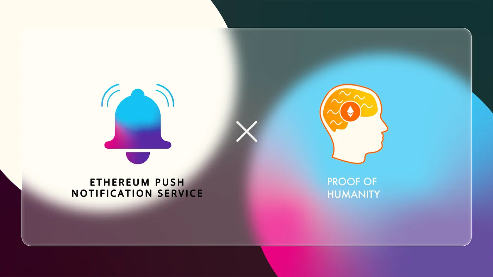

import { ImageText } from '@site/src/css/SharedStyling';

<!--truncate-->

Humans are at the heart of EPNS’s vision and mission. Because humanity is the essence of these humans, is there a better place than this to start discussing our protocol’s use-cases? Probably not. So that’s where we begin, by elaborating the collaboration between EPNS and [Proof of Humanity](https://www.proofofhumanity.id/) (PoH).

Proof of Humanity — a.k.a. ‘The Internet of Humans’ — is an ecosystem for decentralized identities, facilitating the establishment and verification of community-governed trust. PoH is crucial to differentiate bots from humans without entrusting centralized (and therefore, corruptible) actors.

# The Future of Web3: Trust & PoH

Decentralization and trustlessness are quite inseparable. But understanding the latter as a call for the complete elimination of trust is a mistake that people often commit. Trust is an undeniable asset for humanity, a precondition for harmonious progress.

Though trustlessness enables counterparties to interact securely even when they do not (or cannot) trust each other, there are real-life instances where trust is necessary. The future needs innovative models for trust and social identification, particularly in view of its optimal decentralization.

Against this backdrop, the PoH Registry is poised to become one of the pivotal elements of the Web3 stack. And for its part, EPNS is thrilled to have the opportunity of contributing to PoH’s progress.

# Enhancing the PoH Experience with EPNS

Besides Self-Sovereign Identities (SSIDs), PoH enables individuals to access decentralized certifications, quadratic funding, credit scoring, etc. Herein lies PoH’s significance, as these services are foundational to building comprehensive Web3 systems. Especially concerning optimal day-to-day relevance, which is pretty much the need of the hour. Realizing PoH’s role and potential, EPNS now strives to make its user experience seamless.

A PoH profile can be in either of these phases: **Submission**, **Challenge**, **Vouching**, and **Registered**. Submitting a profile entails [multiple steps](https://blog.kleros.io/proof-of-humanity-an-explainer/), making it somewhat meticulous from the end-user’s perspective. The story doesn’t end there, though. To ease the journey from submission to being registered, EPNS notifies users about various profile-related updates in real-time. In courtesy of the collaboration, PoH users will have the following benefits:

- Existing PoH profile holders whose profile has been challenged will be immediately notified allowing them to act in time to save their submission from being removed.
- Users will also be notified when the challenger submits new evidence for their claim.
- Notifications upon removal requests for other reasons, such as inadequate information for instance.
- Users will receive a notification when their profile is registered because there’s no valid challenge.
- Notifications about upcoming profile expiration.

# It’s Only the Beginning

EPNS’s scope concerning Proof of Humanity is vast, and profile-related notifications are only the humble beginning. From Universal Basic Income (UBI) transactions to upcoming airdrops or new certificate issuance, the future holds myriad possibilities.

Trust is, after all, a sensitive matter. In today’s age of information, it is unacceptable for one’s credibility to take a dent simply for the lack of timely awareness. EPNS’s collaboration with PoH is a journey towards mitigating such mishaps.

Individuals won’t ever miss an update from PoH by subscribing to its channel on EPNS. And Web3 will become more reliable and secure as a whole because the chances of interacting with bots instead of humans will be minimal.

# About Proof of Humanity

Proof of Humanity is an Ethereum-based platform for the creation and management of decentralized Digital Identities. The PoH ecosystem leverages webs of trust and reverse Turing tests to create a Sybil-proof and AI-resistant identity registry for humans on the blockchain. Besides facilitating reliable and non-intermediated social verifications, PoH enables myriad use-cases including innovative DAOs, anti-spam tools, and consensus mechanisms for sidechains. In view of these use-cases, PoH emerges as a stepping stone to a more robust and anti-fragile Web3.

Stay in touch! [Website](https://www.proofofhumanity.id/) | [Twitter](https://twitter.com/proofofhumanity) | [Telegram](https://t.me/proofhumanity)
