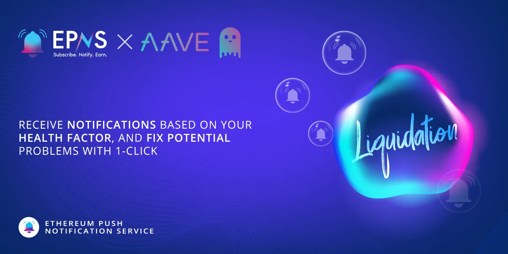

import { ImageText } from '@site/src/css/SharedStyling';

<!--truncate-->

Up until 2015, cryptocurrencies were considered to be mere luxuries or collectibles for the rich. But with the launch of the Ethereum Network and its smart contracts, the perception around digital assets began to change. Ethereum based protocols brought bank-like services onto the blockchain and made them even better with global accessibility, transparency, and security.

Among the protocols that contributed to the unprecedented success of DeFi is AAVE. This decentralized lending platform became the heart of DeFi, contributing to a significant part of the total volume locked.

With its innovative financial services, AAVE also managed to bring in an influx of new users to DeFi. But, the lack of a reliable communication system in DeFi created a void between the users and the network. The user-experience was poor and all updates had to be checked manually. This caused users to miss out on significant updates pertaining to their investments and loans.

But, integrating into AAve decentralized push notifications through EPNS can change this for good.

### How EPNS x AAVE Could Change Communication in DeFi

As mentioned before, AAVE is a non-custodial lending and yield farming protocol for DeFi. The protocol has a variety of liquidity pools funded by liquidity providers and borrowers are required to deposit collateral to obtain loans. However, in cases where the value of the collateral falls below a certain threshold, it is liquidated to protect the lender. But because there is no means of direct communication between the protocol and users, borrowers end up realizing the liquidation long after it’s done. In this situation, they are in no position to take action and end up losing their collateral. This is where EPNS comes into play. We’ve managed to build a robust, reliable communication channel for AAve users and the network to always stay one step ahead and keep your assets safe.

Borrowers on AAVE can subscribe to the channel to get notified whenever their collateral is at risk of being liquidated. This new communication channel will play a huge role in catapulting the success of AAVE by reducing the friction between users and the network and increasing user participation.

A simple communication mechanism like this, could hugely benefit both the users and the protocol. Users would have a significantly improved user-experience where they no longer are worried or constantly in need of manually checking updates. For the protocol, this means increased user-engagement, increased decentralization, and overall better communication with its users.

The Way Forward
===============

DeFi’s lending protocols with their yield farming opportunities and higher rewards shaped the foundations of the industry itself. They transformed the way global financial markets perceived digital assets and cemented their place in the bigger picture. We aim to collaborate with many more DeFi protocols to increase the ease of communication in the industry. By doing so, we aim to safeguard user assets and their newfound trust in DeFi.

