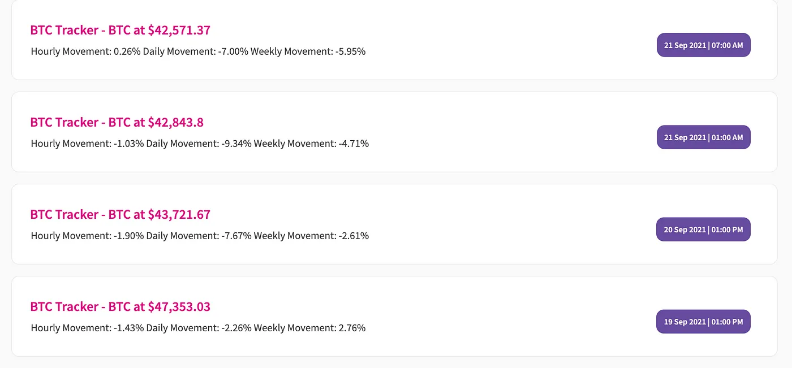

import { ImageText } from '@site/src/css/SharedStyling';


<!--truncate-->

EPNS is an open-source, decentralized notification protocol. The protocol went live on [Ethereum Mainnet on Jan 11th](https://medium.com/ethereum-push-notification-service/the-epns-mainnet-is-here-470faec0c01) and it now has 19 official channels by major projects in Web3 including ENS, MakerDAO, Coindesk and dYdX.

Any service, protocol, or individual who wants to send notifications could start right away with EPNS. **In this post, we’ve made it easy to learn how to get started.**

# EPNS Integration

The initial step for EPNS integration is **channel creation**. Here is the [**step-by-step guide on how to create a channel**](https://medium.com/ethereum-push-notification-service/getting-started-with-epns-ca2dd7f43329).

Once the channel is created, the channel owner could start sending notifications from the dApp and receive notifications on all of the EPNS platforms — dApp, Android App, iOS App, Browser Extension.

# **Integrating with the Backend SDK**

The back-end SDK allows developers & protocols to access EPNS Protocol functionalities from within their backends and implement custom logic for notifications. This SDK also comes packed with tooling for easy debugging and testing of notifications through the _simulate_ object.

Check-out our [**Starter guide to implementing the EPNS backend SDK**](https://github.com/push-protocol/backend-sdk-starter-code)**.** The quickest way to get started using our SDK.

Here is how you can integrate the SDK to your back-end server:

**Step 1:** Install the npm package

```
npm install @epnsproject/backend-sdk
//this is the package for our production environment**OR**npm install @epnsproject/backend-sdk-staging
//this is the package for our staging environment recommended for testing.
```

**Step 2:** Import the package.

```
import EpnsSDK from "@epnsproject/backend-sdk"
// for production**OR**import EpnsSDK from "@epnsproject/backend-sdk-staging"
// for testing or development.
```

**Step 3:** Initialise the SDK instance.

```
// the private key of the address which you used to create a channel
const  CHANNEL\_PK = '0x0000000000000000000000000000000000000000000000000000000000000fff';// Initialise the SDK
const  epnsSdk = new EpnsSDK(CHANNEL\_PK);const  CHANNEL\_PK = '0x0000000000000000000000000000000000000000000000000000000000000fff'; // the private key of the address which you used to create a channel// Initialise the SDK
const  epnsSdk = new EpnsSDK(CHANNEL\_PK);
```

If you are yet to create a channel you can proceed to [our staging dapp](http://staging-app.epns.io/) to create one or refer to our [how-to guides](https://www.notion.so/epns/How-to-EPNS-853afe64839b4cdd8c63209342a783d0).

**Step 4:** Implement the notification logic whether it’s on-chain or off-chain, based on which the notification is to be sent.

**Step 5:** Let's send a notification!!

```
const tx = await sdk.sendNotification(
        recipientAddress,
        pushNotificationtitle,
        pushNotificationMessage,
        notificationTitle,
        notificationMessage,
        3, //this is the notificationType
        cta, // a url for users to be redirected to
        image ,// an image url, or an empty string
        null, //this can be left as null
      );
```

More details on the parameters for the backend SDK can be found in [the documentation](https://github.com/push-protocol/push-backend-sdk-staging).

The owner of the address specified as the recipient can log into [our staging](https://staging-app.epns.io/) or [production environment](http://app.epns.io/) in order to see the notification received, or get our chrome extension or mobile application in order to receive the notification.

For more complex logic in your notifications you can refer to [the documentation](https://github.com/push-protocol/push-backend-sdk-staging), or clone our [starter guide to implementing our backend SDK](https://github.com/push-protocol/backend-sdk-starter-code) which contains a working example.

# Integrating with the Frontend SDK

Front-end SDK allows developers & protocols to integrate the notifications to their dApp or mobile app.

The SDK comprises of three modules majorly:

- Fetching notifications from the EPNS backend.
- Parsing the fetched notifications.
- Rendering the parsed notification on mobile and the web.

Here is how you can integrate your React Frontend Dapp with EPNS Decentralized notification service:

**Step 1:** Install the npm package

```
npm install @epnsproject/frontend-sdk
```

## Fetching the notifications

**Step 2:** Import the just-installed package.

```
import { api, utils, NotificationItem } from "@epnsproject/frontend-sdk"
```

**Step 3:** Define the required variables to make a request to fetch some notifications!

```
// define the variables required to make a request**const walletAddress = "0x1234567890abcdcdefghijklmnopqrstuvwxyz123";
const pageNumber = 1;
const itemsPerPage = 20;**
```

**Step 4:** Make a request to fetch some notifications!

```
//fetch the notifications**const fetchedNotifications = await api.fetchNotifications(walletAddress, itemsPerPage, pageNumber)
console.log(fetchedNotifications);**
```

## Parsing the notifications

**Step 5:** The next step is to parse the just-fetched notifications, essentially converting the massive object we have you above into a more readable format.

```
//parse the notification fetched**const parsedResponse = utils.parseApiResponse(fetchedNotifications.results);
console.log(parsedResponse);**
```

## **Rendering the notifications**

**Step 6:** Finally, we proceed to render the object above as a notification using JSX.

```
// This is used to render the text present in a notification body as a JSX element**<NotificationItem
notificationTitle="ETH Tracker - ETH at $3,235.16"
notificationBody="\\\[d:Summary & Latest Balance\]\\n---------  \\n\\n\[➕\] \[d:ETH: \] \[b:2.961\] \[t:ETH\] \[\[dg:+-0.000 ETH\]\]\[timestamp: 1630069200\]"
cta="www.cta.com"
/>**
```



# Subscribing to channels from your own DApp

In order to implement signing we take advantage of [EIP-712](https://eips.ethereum.org/EIPS/eip-712) (more details on the **signer** parameter can be found [here](https://eips.ethereum.org/EIPS/eip-712)), you can also take a look at our working [example](https://github.com/push-protocol/push-frontend-sdk-staging/blob/main/sample_codes/loadNotifications/src/App.js)

**Step 1:** Create a button component:

`<button onClick={epnsSubscribe}/>`

**Step 2:** Implement the function to subscribe/unsubscribe to the channel:

```

import {
  channels,
} from "[@epnsproject/frontend-sdk-staging](https://github.com/push-protocol/push-sdk)";const epnsSubscribe = () => {
     await channels.optIn(
         [signer](https://docs.ethers.io/v5/api/signer/),
         channelAddress,
         chainId,
         userAddress,
         {
            onSuccess: () =>  // do something after success
         }
    )}
const epnsUnSubscribe = () => {
     await channels.optOut(
         [signer](https://docs.ethers.io/v5/api/signer/),
         channelAddress,
         chainId,
         userAddress,
         {
            onSuccess: () =>  // do something after success
         }
    )}
```

# Mainnet URLs

**EPNS dapp** -[https://app.epns.io/](https://app.epns.io/)

**Back-end SDK** - [https://www.npmjs.com/package/@epnsproject/backend-sdk](https://www.npmjs.com/package/@epnsproject/backend-sdk)

**Front-end SDK** - [https://www.npmjs.com/package/@epnsproject/frontend-sdk](https://www.npmjs.com/package/@epnsproject/frontend-sdk)

# Testnet URLs

**EPNS Staging dapp** -[https://staging-app.epns.io/](https://staging-app.epns.io/)

**Back-end SDK Staging** - [https://www.npmjs.com/package/@epnsproject/backend-sdk-staging](https://www.npmjs.com/package/@epnsproject/backend-sdk-staging)

**Front-end SDK Staging** -[https://www.npmjs.com/package/@epnsproject/frontend-sdk-staging](https://www.npmjs.com/package/@epnsproject/frontend-sdk-staging)

# Starter Repositories URLs

**Frontend SDK starter code** —  
[https://github.com/push-protocol/push-frontend-sdk-staging/tree/main/sample_codes/loadNotifications](https://github.com/push-protocol/push-frontend-sdk-staging/tree/main/sample_codes/loadNotifications)

**Backend SDK starter code —**

[https://github.com/push-protocol/backend-sdk-starter-code](https://github.com/push-protocol/backend-sdk-starter-code)
