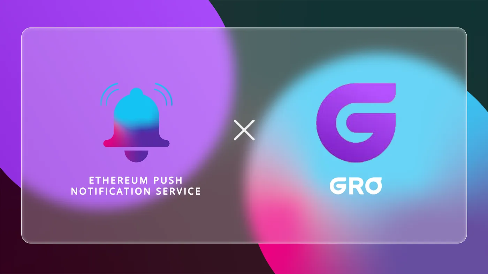

import { ImageText } from '@site/src/css/SharedStyling';

<!--truncate-->

With interest rates and stock markets plummeting in the wake of the pandemic, the DeFi industry came as an attractive new opportunity for investors who benefited from its global accessibility and higher returns. Yet, the majority of financial products in DeFi still cater to investors with a higher risk appetite. Risk-averse investors still find it very difficult to enter the decentralized framework and as such are left out of the revolution.

For DeFi to be able to compete with TradFi and potentially replace it needs to cater to varying risk appetites of investors and make it easy for users to transition into the decentralized world. DeFi’s emergent [Gro Protocol](https://app.gro.xyz/) was launched in an effort to achieve this and we at EPNS are pleased to partner with them on this ambitious journey.

### How Gro Protocol Can Benefit From Decentralized Notifications

Gro Protocol is a DeFi yield optimizer and stablecoin yield aggregator that is built to balance risk and protect savings through its tranching mechanism. The protocol offers PWRD and Vault that cater to varying risk appetites and combine the best of TradFi and DeFi to provide ideal returns to investors.

PWRD is a protected savings product that consists of stablecoin baskets and the risk here is diversified across protocols and stablecoins used to ensure that investors get the best possible returns while being protected against exotic risks like protocol exploitation. Vault, on the other hand, is a product with a slightly higher risk factor that protects PWRD in return for sharing yield from PWRD deposits. Both these products are designed to offer everyday investors a taste of DeFi higher returns and transparency while efficiently optimizing to balance risk and yields.

The protocol’s native GRO token acts as a medium of exchange within the network and it can be earned through airdrops, liquidity mining, and vesting bonuses. In this regard, there is a need for a reliable channel of communication between users and the protocol to keep users updated about the status of their GRO tokens and EPNS helps build this channel.

What Does the Collaboration Entail
==================================

Through our pilot collaboration with Gro Protocol, we aim to create a means of seamless communication between users and the protocol through decentralized push notifications. Gro Protocol will have an official channel on EPNS that is set to go live in February this year. Users can subscribe to this channel to receive notifications whenever

*   New airdrops are available for users to claim.
*   Airdrops are about to expire.
*   They are eligible to claim GRO tokens from Vesting Bonus Pool.

As Gro Protocol works towards making DeFi accessible to everyday users, we’re pleased to collaborate with them on this journey and hope to be an integral part of their operations.

**About Gro Protocol**
======================

[Gro](https://www.gro.xyz) is a DeFi protocol offering leveraged and protected stablecoin yields through risk tranching. Its products include PWRD, Vault and Labs. Gro protocol uses an automated portfolio of stablecoin yield strategies to balance yield against risk. PWRD users are protected from loss by Vault users, who take a leveraged share of protocol returns from PWRD. As Gro focuses almost entirely on stablecoins, market price volatility is minimized, even in higher risk products.

To learn more about Gro: [dApp](http://app.gro.xyz) | [Docs](https://docs.gro.xyz) | [Medium](https://groprotocol.medium.com/) | [Twitter](http://www.twitter.com/groprotocol) | [Discord](http://discord.gg/gro) | [Telegram](https://t.me/gro_announcements) | [Youtube](https://www.youtube.com/channel/UCSQeNePRCe-rfCs1eLjOhTw)

