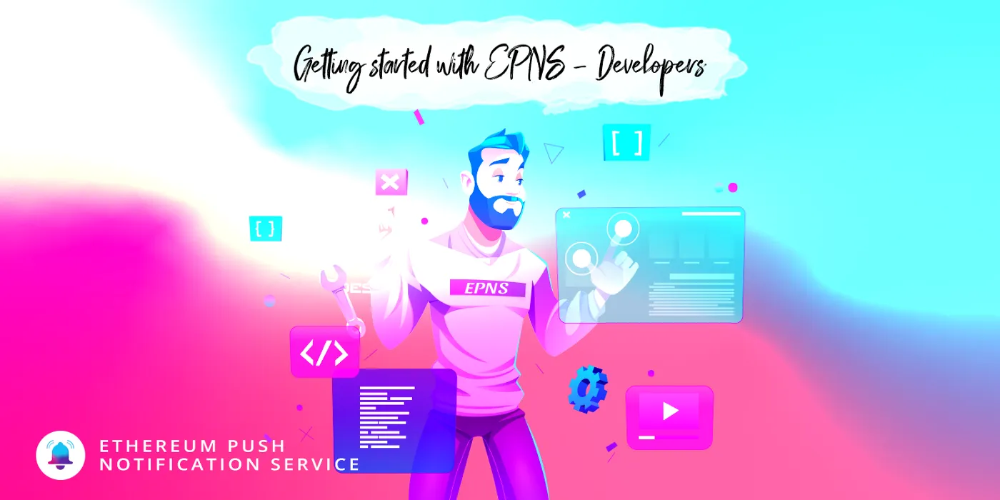

import { ImageText } from '@site/src/css/SharedStyling';



<!--truncate-->

EPNS is an open-source, decentralized notification protocol. The protocol went live on [Ethereum Mainnet on Jan 11th](https://medium.com/ethereum-push-notification-service/the-epns-mainnet-is-here-470faec0c01) and it now has 19 official channels by major projects in Web3 including ENS, MakerDAO, Coindesk and dYdX.

Any service, protocol, or individual who wants to include the functionality to include notifications in their dApp could follow this guide. **In this post, we’ve made it easy to learn how to get started.**

EPNS Integration
================

The initial step for EPNS integration is **channel creation**. Here is the [**step-by-step guide on how to create a channel**](https://medium.com/ethereum-push-notification-service/getting-started-with-epns-ca2dd7f43329).

Once the channel is created, the channel owner could start sending notifications from the dApp and receive notifications on all of the EPNS platforms — dApp, Android App, iOS App, Browser Extension, and the users would have to subscribe on our dApp, but after this integration, you would be able to perform that very functionality on your dApp.

Integrating with the Frontend SDK
=================================

Front-end SDK allows developers & protocols to integrate the notifications to their dApp or mobile app, we would specifically be focusing on the channel module of it.

This module comprises of three sub-modules majorly:

*   Opt in and out to a channel from the SDK
*   Fetching the details of a channel by using it’s address as an identifier.
*   Find out if a user is subscribed to a channel.

Here is how you can integrate your React Frontend Dapp with EPNS Decentralized notification service:

**Step 1:** Install the npm package

```
npm install @epnsproject/frontend-sdk
```

Subscribing to the channel
--------------------------

**Step 2:** Import the channels module from the package.

```
import { channels } from "@epnsproject/frontend-sdk-staging";
```

**Step 3:** Define the required variables to make a request to fetch some notifications!

```
const { library, active, account, chainId } = useWeb3React();const signer = library.getSigner(account); //this could also be any entity which has a method \`\_signTypedData(domain, type, message)\` which is capable of signing messages using eip 712.const channelAddress = "0x94c3016ef3e503774630fC71F59B8Da9f7D470B7"; //the address of the channel we want to op-in to or opt-out fromconst chainId = 1; //this is for the ethereum network, and can be any of out supported chains.const userAddress = "0x57c1D4dbFBc9F8cB77709493cc43eaA3CD505432";
```

it is worth noting that the \*signer\* variable could be gotten through other means, for more information on the signer object, please refer to [this article.](https://docs.ethers.io/v5/api/signer/#Signer)

**Step 4:** Opt in-to or out-of the channel!

```
const epnsSubscribe = () => {  
     await channels.optIn(  
         [signer](https://docs.ethers.io/v5/api/signer/),  
         channelAddress,  
         chainId,  
         userAddress,  
         {  
            onSuccess: () => "so something"  // do something after success  
         }  
    )}  
const epnsUnSubscribe = () => {  
     await channels.optOut(  
         [signer](https://docs.ethers.io/v5/api/signer/),  
         channelAddress,  
         chainId,  
         userAddress,  
         {  
            onSuccess: () => "do something"  // do something after success  
         }  
    )}
```

Step 5:
-------

Check if the user is subscribed to the current channel, in order to know if to subscribe to the user or unsubscribe them.

```
const \[isSubscribed, setIsSubscribed\] = useState(false);  
channels.isUserSubscribed(userAddress, channelAddress)  
.then((res) => {  
      setIsSubscribed(res);  
});
```

Putting it all together
-----------------------

**Step 6:** Finally, we proceed to combine all the above into a coherent code.

```
import { useEffect, useState } from "react";  
import { useWeb3React } from "[@web3](http://twitter.com/web3)\-react/core";  
import { channels } from "[@epnsproject/frontend-sdk-staging](http://twitter.com/epnsproject/frontend-sdk-staging)";  
import ConnectButton from "./components/connect";  
import "./App.scss";const CHANNEL\_ADDRESS = "0x94c3016ef3e503774630fC71F59B8Da9f7D470B7";function App() {  
  const { library, active, account, chainId } = useWeb3React();// create state components to fetch all the notifications.  
  const \[isSubscribed, setIsSubscribed\] = useState(false);// channel details  
  const \[channel, setChannel\] = useState(null);  
  // load channel details on start  
  useEffect(() => {  
    if (!account) return;  
    // on page load, fetch channel details  
    channels.getChannelByAddress(CHANNEL\_ADDRESS).then((data) => {  
      setChannel(data);  
    });  
    // fetch if user is subscribed to channel  
    channels.isUserSubscribed(account, CHANNEL\_ADDRESS).then((res) => {  
      console.log(res);  
      setIsSubscribed(res);  
    });  
  }, \[account\]);const epnsSubscribe = () => {  
     await channels.optIn(  
         [signer](https://docs.ethers.io/v5/api/signer/),  
         channelAddress,  
         chainId,  
         userAddress,  
         {  
            onSuccess: () => "so something"  // do something after success  
         }  
    )}  
const epnsUnSubscribe = () => {  
     await channels.optOut(  
         [signer](https://docs.ethers.io/v5/api/signer/),  
         channelAddress,  
         chainId,  
         userAddress,  
         {  
            onSuccess: () => "do something"  // do something after success  
         }  
    )}return (  
    <div className="App">  
      {/\* define the header \*/}  
      <h2 className="App\_\_header">  
        <span> EPNS Playground </span>  
        <ConnectButton />  
      </h2>  
      {/\* define the header \*/}{active ? (  
        <>  
          {/\* section for channels \*/}  
          {channel && (  
            <div>  
              <h3>Sample clear  
                code Channel</h3>  
              <div className="sample\_\_channel">  
                <div>  
                    
                  <h2>{channel.name}</h2>  
                </div>  
                <div  
                  onClick={() => {  
                    isSubscribed  
                      ? epnsUnSubscribe()  
                      : epnsSubscribe()  
                  }}  
                  className="subscribebutton"  
                >  
                  {isSubscribed ? "unsubscribe" : "subscribe"}  
                </div>  
              </div>  
            </div>  
          )}  
          {/\* section for channels \*/}</>  
      ) : (  
        <p>Please connect to your wallet on the kovan test network to proceed</p>  
      )}  
    </div>  
  );  
}export default App;
```

Link to GitHub code with a working example
==========================================

[https://github.com/push-protocol/push-opt-demo](https://github.com/push-protocol/push-opt-demo)

Mainnet URLs
============

**EPNS dapp** -[https://app.epns.io/](https://app.epns.io/)

**Front-end SDK** — [https://www.npmjs.com/package/@epnsproject/frontend-sdk](https://www.npmjs.com/package/@epnsproject/frontend-sdk)

Testnet URLs
============

**EPNS Staging dapp** -[https://staging-app.epns.io/](https://staging-app.epns.io/)

**Front-end SDK Staging** -[https://www.npmjs.com/package/@epnsproject/frontend-sdk-staging](https://www.npmjs.com/package/@epnsproject/frontend-sdk-staging)

Follow us to stay up to date: [Twitter](https://twitter.com/epnsproject), [Discord](https://discord.gg/YVPB99F9W5), [Telegram](https://t.me/epnsproject).
