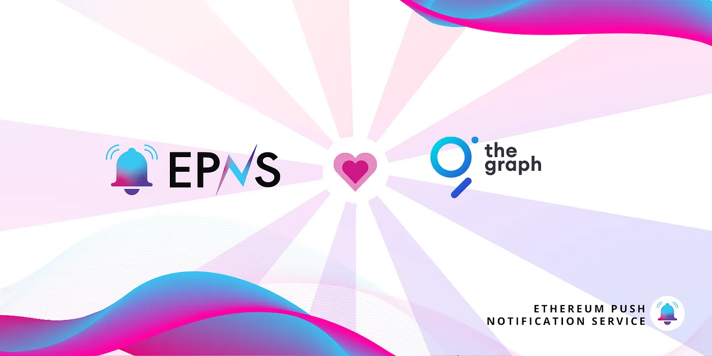
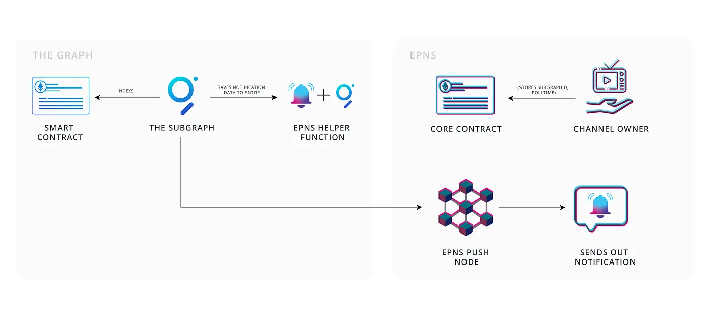

import { ImageText } from '@site/src/css/SharedStyling';

<!--truncate-->

As the blockchain ecosystem has grown, so too has the challenge of accessing on-chain data across multiple blockchain networks. The Graph is an indexing protocol that indexes, organises and makes data accessible from networks like Ethereum and IPFS It is often referred to as “Google” for the blockchains. As more and more data finds its way on-chain, users and developers need to access organised data efficiently.

Today, EPNS is excited to announce integration of The Graph to combine the power of subgraphs with notifications! The integration leverages a core EPNS feature that enables developers to establish customised notifications and “call to actions” so they can more easily access data.

### About EPNS X The Graph Integration

Before we dive into the integration, let’s give you an overview of what each one of us have been doing to give you a better understanding of how this integration works, who it is targeted to, and what benefits users will gain.

#### About Ethereum Push Notification Service (EPNS)

EPNS is a decentralised communication protocol for web3! It allows any dapp, smart contract, backend or protocol to send communication directly to user wallet addresses in an open, gasless, and platform-agnostic fashion.

#### About The Graph

The Graph is the indexing and query layer of web3. Developers build and publish open APIs, called subgraphs, that applications can query using GraphQL. Tens of thousands of developers use The Graph for applications such as Uniswap, Synthetix, KnownOrigin, Art Blocks, Gnosis, Balancer, Livepeer, DAOstack, Audius, Decentraland, and many others.

Now, back to the <b>EPNS x The Graph</b> integration and how it helps. Until this integration, channel creators or developers have to:

1. Create a channel, which is mandatory.
2. Once a channel is created, you will need to send out notifs, for which you have to set/define logics at the back end.

To send notifs on your channel, there were two methods which you can use:

1. Using the backend SDK ([Showrunners Framework](https://medium.com/ethereum-push-notification-service/epns-showrunners-framework-and-backend-sdk-beta-v1-0-are-live-7348c0725a12))
2. Using [smart contracts](https://docs.epns.io/developers/developer-zone/examples/smart-contracts-example)

However to do so, both methods required a decent amount of development work to code the logic using the SDKs.

With The Graph integration, you’ll now be able to send EPNS notifications directly from your subgraph. With this new integration using the subgraph and EPNS, we are simplifying the process and minimising the need for extra development.

<ImageText>High level integration diagram</ImageText>

To expand on this, let’s take a look at how this feature and integration is enabling a better way to access indexed data from the blockchain to send notifications.

#### What does The Graph help with?

- The biggest pain point you are able to address via The Graph is fetching data from the blockchain and customising it the way you want. Typically, if you were trying to do this directly from the blockchain, it would be very inefficient.
- There hasn’t been a specific aggregator to check/run queries of all transactions in one place. And that’s where The Graph comes in. Using a subgraph, you can define how you want to see your data, automatically indexing each block from the blockchain.
- Mainly querying data via a backend from the blockchain takes a lot of time and is a centralised approach, and that’s something that subgraphs help with
- Subgraphs also have the ability to index different blockchains. Community members can directly query the data from the subgraph.

#### Where does EPNS come in?

- Using EPNS, developers can get notifications via their channels on EPNS, and get better access to the indexed data created via their subgraphs with this new integration.
- If your channel doesn’t have a subgraph, you can first define that in a subgraph and then further use this new feature to send notifs as per your logic.
- Illustrating via an example, if you’ve deployed a Uniswap contract and a swap’s happening, then the developer can define an action as to what should happen if a swap event has happened. And accordingly push notifications for them.
- The integration eases the process, reduces the time of sending custom notifs by simply integrating the subgraph without the need of a server or spending too much time coding your own logic at the back end.

#### Benefits of the EPNS x The Graph integration

- With this integration, notifications can directly be triggered from a subgraph(see our [lightpaper](https://medium.com/ethereum-push-notification-service/ethereum-push-notification-service-litepaper-e7ca0a662862) for definitions of channels, services, and more)
- Developers can use all the power and flexibility of subgraphs and use that as the logic for their notifications.

Note: Subgraph integration is available on staging right now.

<blockquote><i>

Real-time push notifications were for a long time a missing part in the web3 stack. EPNS solves this with a decentralised notification system. Thanks to the integration with The Graph it is much easier to send those notifications to users. A subgraph can now be used as the trigger for notifications. This is very convenient for dapps which already have a subgraph and I also expect that this will become the default setup in the future. —
<b>Simon Emanuel Schmid, Solutions Engineer at Edge & Node working on The Graph</b>

With growing adoption of decentralised infrastructure, simplifying data and making it accessible for users will be key. We see The Graph and EPNS as a great opportunity to bring the most seamless user experience to dapp developers. We are looking forward to working with The Graph team to make the decentralised network even stronger with this integration. — <b>Harsh Rajat, EPNS founder</b>

</i></blockquote>
