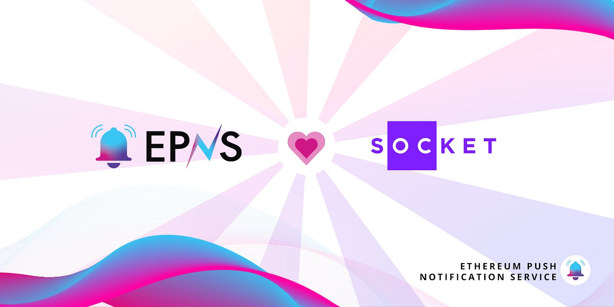

import { ImageText } from '@site/src/css/SharedStyling';

<!--truncate-->

<!--customheaderpoint-->
# Socket, the blockchain interoperability infrastructure platform, partners with EPNS to send decentralized push notifications to its users.

There has been a <b>growing number of blockchains</b>, each offering its own unique set of benefits. While some offer the utmost decentralization, others are carved out for scalability, and then some are exclusively meant to support NFTs. The <b>growing number of blockchains</b> and their categorization isn’t particularly a bad thing.

However, blockchains, by design, cannot communicate with or read data from sources outside their own ecosystem. This results in many high-potential but segregated blockchain ecosystems, each having its own isolated set of applications, platforms, and users.

As a solution, we have projects working to address the lack of interoperability to help apps and users transfer data and value across different chains. One project that is leading the charge in interoperability is Socket. And we are thrilled to announce that EPNS is partnering with this innovative project to bring a decentralized push notification service to its users.

## Where Does EPNS Fit Into Socket’s Equation?
Socket enables blockchain interoperability through its two key components:

1. The Socket Liquidity Layer acts as a DEX aggregator and ensures users can easily transfer funds across blockchains as per their speed, fee, and security preferences.

2. Socket Data Layer is a messaging layer that smart contracts and, thus, dapps hosted across blockchains can seamlessly interact and share data with each other.

With these two components, Socket offers developers the base infrastructure to build dapps that can operate across multiple chains. This also translates to the fact that users of the dapps using Socket’s infra would be able to easily transfer value across chains. And this is where EPNS comes into the picture.

<b>Socket will use EPNS to notify its dapp users whenever bridging between two chains is complete</b>. Further, users will have the option to get notified whenever the gas fees drop so they can execute their cross-chain transactions for the lowest possible fee.

It is a delight for us to be partnering with projects like Socket that are genuinely pushing the bars higher for interoperability standards. While we have kicked off this collaboration with two use cases, we are excited to explore more use cases as the platform develops and new possibilities come into the picture.

Stay tuned to keep updated on the most recent EPNS partnerships and developments around the decentralized push notification standards!

### About Socket
[Socket](https://socket.tech/) is an interoperability protocol for secure & efficient data and asset transfers across chains. Socket is not a bridge or a cross-chain app — it is an infrastructure that allows developers to build these things easily. Developers can use Socket to build apps with interoperability as a core part of app infrastructure.

[Website](http://socket.tech/) | [Bungee](http://bungee.exchange/) | [Twitter](https://twitter.com/SocketDotTech) | [Discord](https://t.co/Il4enrA7Lo)

### About Push Protocol

Push is the communication protocol of web3. Push protocol enables cross-chain notifications and messaging for dapps, wallets, and services tied to wallet addresses in an open, gasless, and platform-agnostic fashion. The open communication layer allows any crypto wallet /frontend to tap into the network and get the communication across.

To keep up-to-date with Push Protocol: [Website](https://push.org/), [Twitter](https://twitter.com/pushprotocol), [Telegram](https://t.me/epnsproject), [Discord](https://discord.gg/pushprotocol), [YouTube](https://www.youtube.com/c/EthereumPushNotificationService), and [Linktree](https://linktr.ee/pushprotocol).

