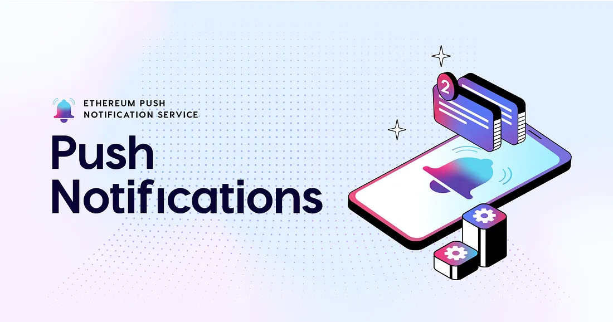
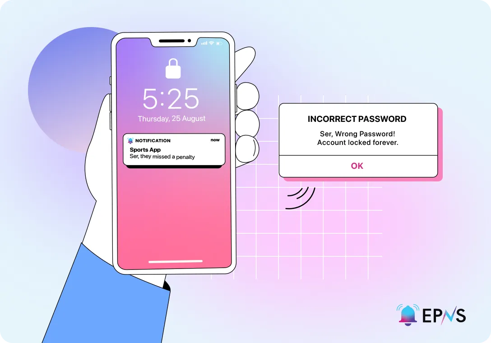
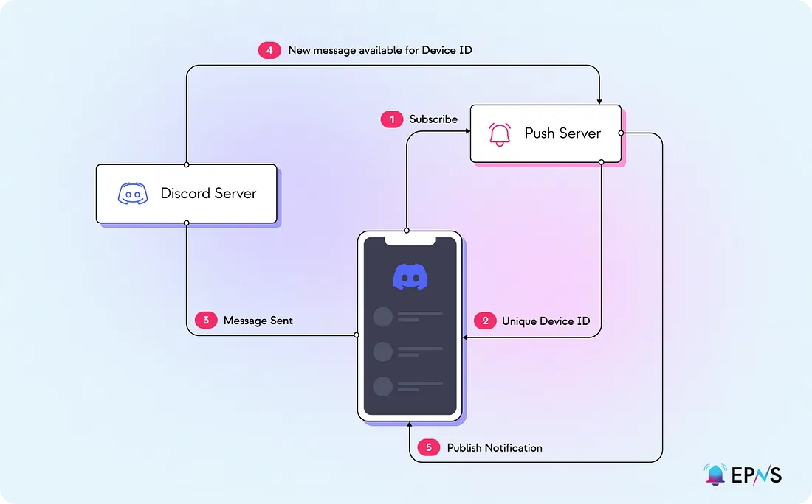

<!--customheaderpoint-->
# An Introduction to Push Notification: Part 1.1 

It is hard to imagine modern mobile devices without push notifications. The first push service was launched by Apple in June 2009, the Apple Push Notification Service (APNs). After that, Google followed with a service of their own, Google Cloud to Device Messaging (C2DM). Both companies have led efforts to enhance the push notification technology to where it is today.

<!--truncate-->

Push notifications are a type of message that can be presented in an alert-based format, such as message alerts, pop-ups, and banners. They serve as a mechanism that informs users about all kinds of information. Today, push notifications have dynamic traits with app components directly built into the notification delivery scheme.

Before the implementation of push notifications, different methods were used to send messages to apps, like maintaining a permanent open TCP/IP connection to a web server to receive real-time notifications (isn’t efficient and not practical for modern devices) and polling, which requires a real-time request to prompt a notification (polling follows the request/response model).

## An Overview of Push Notifications
Messages allow for the transferability of information over the internet and are integral to communication among networks. In traditional client-server models, there are two types of messages: requests and responses. Push notifications are a type of response message from the server side, known as a server push. The server push requires a network request and is often event-driven, as in, if event “n” happens, trigger a response that pushes message “m” to the client.

The majority of applications provide responses to the user based on the actions they take on the application. For instance, if a user tries to log into a social media account but enters the wrong credentials, the server may prompt a message “ser, wrong password, account locked forever.” A notification example that shows asynchronous messaging is a user who has a sports app on their device and receives real-time game updates about professional sports games being played simultaneously.

### An example with Discord
Take the case of using Discord to keep up with all of your favorite crypto projects. Assuming you have allowed for notifications (1,2) if someone from the [EPNS Discord](https://discord.gg/YVPB99F9W5) server sends a message to a channel (3), the Discord server informs the push server of the availability of the new message (4). The server uses a unique ID associated with your device to push the new message as a notification (5). The push mechanism is not used when the Discord app is open on your device, as messages are sent directly from Discord’s server to your account. The way your device receives the notification in real-time is by retaining a single connection (like a WLAN connection) whenever you close Discord. This method is used as opposed to each app on your device having its own connection. Note: this is a simplified version of how notifications [can] work on Discord.

To receive server pushes, a client must first subscribe to information channels provided by the server. This requires permission on the client side. When subscribed to push notifications, a publisher can push information. This is known as the publish/subscriber model. In general, the publish/subscribe mechanism includes peers who congregate around a topic they are interested in which lives on a central server, and these peers are said to be subscribed to that topic. Whenever new content is available on one of the information channels, the server pushes that information out to the client. Typically, push notifications are pushed to a client app that a user is using from an application server. Server pushes work because of a continuously open connection between a client device or interface, and the push service. A server provided by the operating system developer acts as middleware between the service and the client device by curating the communication with the device. The device registers on the push server with a unique ID to send the right messages to the right device. Thus, push technology can be considered a type of communication protocol with a centralized service provider.

## Push Notification Providers
Push notification providers allow apps to send notifications to their users. This is where APNs and C2DM would fall under. As an app publisher, the app can easily send messages, and these messages take different forms. A push notification provider gives you a platform on which you can create, schedule, and deliver messages to users and allow apps to compose, target, and execute message campaigns. Today, push notifications are not only a way to provide information, but have become a standard for communication.

## Using Push Notifications
Beyond the examples we gave, push notifications have a ton of use cases and can certainly enhance application experience, engagement, and general communication. The obvious is that users can obtain information in real-time about [almost] anything. In general, apps can establish direct communication channels that operate in an asynchronous format, engage users with curated content, and drive application traffic, all while ensuring users are up-to-date and informed of future events/changes.

Outside of messaging notifications, push notifications are often unfavorable based on their usage for marketing and advertising. The frequency of notifications is also challenging to figure out. In addition, knowledge resources and assets are completely controlled by service providers who have the ability to generate narratives; they are the source of truth for the messages that are pushed.

## Next-generation Push Notifications
How do we take push technology to the next level? By taking the service away from the service provider; from client/server to peers. Peers can facilitate messages as they wish. There is more data integrity within the resources that are pushed to peers as the peers are able to control the data.

Many networks are already building the next generation of the internet, aka web3. However, the user experience in web3 is still mediocre and lacks the characteristics of seamless interactions and communication as found in the current web model. Along with many yet-to-be components, there is a critical piece missing: notifications. Users using web3 applications are forced to manually keep up-to-date with everything they are interacting with, manually conduct activities on their account, and operate in isolation. Bringing push notifications to web3 not only addresses some of the current pitfalls of push notifications but fundamentally improves the web3 user experience to a level capable of bringing on mass adoption.

In the coming articles, we’ll explore how push notifications fit in web3 and dive into the key concepts mentioned earlier.

<i>By Danny Salman</i>

### About Push Protocol

Push is the communication protocol of web3. Push protocol enables cross-chain notifications and messaging for dapps, wallets, and services tied to wallet addresses in an open, gasless, and platform-agnostic fashion. The open communication layer allows any crypto wallet /frontend to tap into the network and get the communication across.

To keep up-to-date with Push Protocol: [Website](https://push.org/), [Twitter](https://twitter.com/pushprotocol), [Telegram](https://t.me/epnsproject), [Discord](https://discord.gg/pushprotocol), [YouTube](https://www.youtube.com/c/EthereumPushNotificationService), and [Linktree](https://linktr.ee/pushprotocol).
