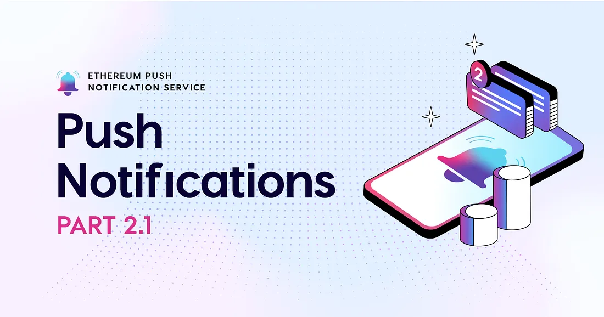
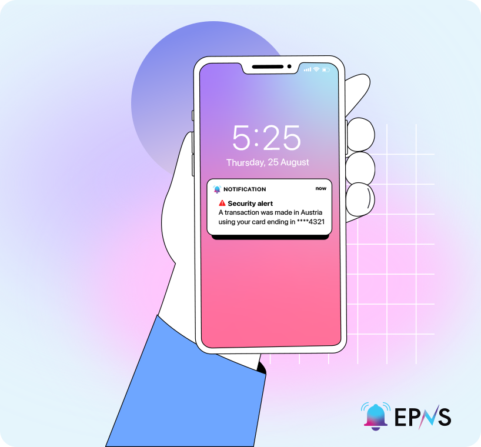

<!--customheaderpoint-->
# An Introduction to Push Notification: Part 2.1 

Part 2 of the <a href="https://medium.com/ethereum-push-notification-service/tagged/pn101"><i>An Introduction to Push Notification</i></a> series will focus on use cases for push notifications in web3, and demonstrate how the web3 communication layer is the missing piece for the next iteration of the web. In this post, we will focus on decentralized finance (DeFi).

<!--truncate-->

While there are trade-offs to be made, DeFi should not be a step back in financial processes or user experience. The web3 communication layer enables solutions to increase the DeFi experience significantly. Let’s take some time to consider some of the current pitfalls in DeFi.

All financial products come with a degree of uncertainty. In centralized finance, uncertainties exist around safety, security, privacy, data integrity, and trust. However, centralized financial products work well for what they are supposed to do, with the caveat that the financial service provider controls the product and its usage. These products usually have sufficient user experiences with appropriate measures to inform users about essential information.

An example:

Modern financial systems use server pushes to send different information based on account activity. For instance, if you conduct a transaction from a foreign IP address, your bank’s server may push a notification to you through one (or many) information channels you are subscribed to, informing you about the transaction as a security precaution.

By design, decentralized financial products aim to alleviate many uncertainties in centralized finance; users can safely and securely participate in financial services without permission, control their financial data, and don’t have to trust a financial service provider. DeFi products and services are still yet to reach this optimal vision. Yet, even in a world of optimal DeFi applications, the current user experience is uninformative, limits authentic engagement, and is not practical for the average user.

Today, DeFi applications and services come with a high degree of uncertainty. DeFi users shouldn’t have to manually check activity constantly or depend on individuals’ efforts to release updates and findings on social channels. As unfortunate as hacks and exploits are, there should also be time-sensitive alerts about suspicious or unusual DeFi events, especially with the emergent nature of DeFi. In general, using EPNS as a communication layer enables:

- Wallet-to-wallet and wallet-to-dapp messaging: user-centric messaging, regardless of platform or device, to communicate about the activity that matters most. Users also shouldn’t experience the limitations of account-based communication that exist in the financial world today.
- Real-time updates about a range of DeFi primitives, such as price volatility, liquidity supply, state of liquidity pools, LP positions, loan positions, and Epoch farming.

And more.

An example:

Take, for instance, a DeFi asset management tool that manages LP positions in liquidity pools across different dapps. The tool’s purpose is to provide and deploy dynamic LP strategies for various LP pools. The tool monitors specific statistics and transaction data to achieve this. Despite the tool’s helpful service in managing assets and minimizing risk, how does the user know:

- which pool their liquidity is in without checking?
- the state of the liquidity pools?
- if the strategies of the tool change?
- how to avoid a certain threshold of risk without constantly engaging with the tool?

and so on.

Adding EPNS as the messaging protocol to the DeFi asset management tool, wallets can opt-in notifications they find most valuable and cater those notifications to metrics they are most comfortable with, all in a gasless manner.

DeFi solutions across web3 continue to integrate with EPNS to alleviate the friction with their end-users and fill the communication gap. An example of this is [Bancor](https://medium.com/u/2bd55d9e5fb5?source=post_page-----fe917fe7c193--------------------------------), a growing EVM-based AMM (automated market maker), recently integrated EPNS and has an EPNS- based communication channel where a variety of messages are pushed to Bancor users, such as updates on liquidity mining, fee changes, and new token listings, to name a few.

Push services through push or alert nodes aren’t new, but a chain agnostic solution that is robust, modular, and interoperable is yet to be established. The web3 communication layer allows for universal notifications, no matter the use case or the platform. EPNS encourages universal messaging, so dapps and wallets can talk to each other and notify their users. Without effective communication in place between peers, the goal for mass DeFi adaption is far-fetched. We will continue to explore other use cases for EPNS in the coming articles, stay tuned!

<i>By Danny Salman</i>

