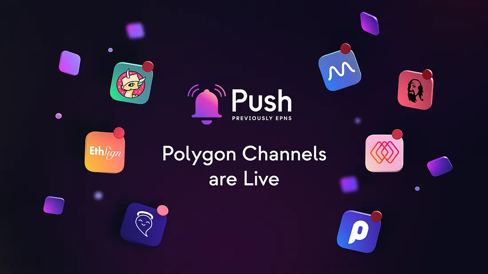

<!--customheaderpoint-->
# Seven protocols have joined Push to bring better UX to the Polygon Ecosystem. 

Push Protocol has recently launched on Polygon with [Lens](https://medium.com/push-protocol/push-and-lens-powering-ux-with-notifications-and-aaves-lens-85828638e691) being the official launch partner. Today, we are excited to announce, some old, and some new friends are combining forces with Push to grow and strengthen their presence in the Polygon ecosystem.

<!--truncate-->

In today’s post, we are going to explore some of the use cases of these frens supported by Push.

## Decentralized Finance (DeFi) Provides Transactional Updates with Push Notifications
DeFi has proven itself to be a key pillar of web3 since the start of DeFi Summer. Every day, tens of thousands, if not hundreds of thousands of people are executing transactions, buying & selling, borrowing & lending, yield farming, and doing all kinds of activities on various dapps. Even though there have been major developments and upgrades on the application level and the smart contract level, UX still remains one of the main friction points. Users need to keep themselves informed about the projects they are trading on via Twitter, Discord, and Telegram. If users forget to check updates for some time, god forbid their loan might be liquidated or their position might be closed out because of some unexpected events that happened when they weren’t checking.

This is where notifications come in handy and why Push is very proud to announce it is bringing the critical notification solution to DeFi dapps on Polygon. Use cases we have established with our partners, such as [QiDao](https://app.push.org/#/channels?channel=0x994909594Ef6c80cE8d9C85Ad30AeC696E10f73E) and [Mean Finance](https://app.push.org/#/channels?channel=0x2f5ccA6f594118ef54f4157927A323BaA982Fd78) are to remind their users when their loan or collateral is approaching liquidation and other key stats which are critical for users to take urgent actions upon. For educational and fun DeFi projects such as [GoodGhosting](https://app.push.org/#/channels?channel=0xe8381F84a32A4C2B08c328BfF68c0E889a34F255), Push is keeping its users updated on the latest pool and round start dates so users can participate in those pools on time to enjoy the full benefits. For those gamblers in web3 (aren’t we all), Push is alerting users of [Pool Together](https://app.push.org/#/channels?channel=0xdc0964aaacE97CF4E7476B4EEbC924730E524ade) on changes in the prize pool and if they win in any of the four governance-managed prize pools.

## Governance Teams Increase Voting Turnout, Powered by Push
Governance is one of the most common use cases for Push notifications. DAOs and the governance team in web3 know the pain of having to constantly remind communities to vote on important issues all too well, only to be blamed afterward if some members did not see any notification in the first place and missed out. To use [MahaDAO](https://app.push.org/#/channels?channel=0x64A971F0D01b3555Ac60B9Bd151d5B7A75cf12Fd) as an example, MahaDAO is using push notifications to inform its community when a new governance proposal is made and is ready for voting, so the governance manager never has to worry about turnout again.

## Push Notifications Help NFT and Gaming Projects Keep Players on the Hook
Much hope and excitement have been put into web3 gaming and NFT space. Despite the huge influx of funding flowing into the space, UX and the sophistication of gaming design are still very much a work in progress. Smooth onboarding of users, In-depth understanding of players and players’ community will help to accelerate the mass adoption of blockchain-based gaming. Push is working together with leading gaming teams such as [Polychain Monster](https://app.push.org/#/channels?channel=0x27F68B2C092DB48928D70EA781F7dE8B844ad07B) to enable direct communications between players and platforms. Players will receive notifications regarding their rewards, game updates, or airdrop of any rare NFTs, keeping them well-informed of the progress they’ve made in the game and players are more likely to stay.

## Tooling Offers Smooth User Journey with Push
Web3 is eating up web2, starting with the metamorphosis of various web2 tooling. ETH Sign is a perfect example of evolving from an established web2 tech solution, taking it on-chain to facilitate immutable and verifiable document signing. With Push, [ETH Sign](https://app.push.org/#/channels?channel=0x77f319B1d9c43a8B729399f81515166632100744) is able to notify signees at each step of the signing process while making sure comments are seen and checked.

## In the Web3 World, We Push Together
While the use cases listed above provide a good first view of the extensive capabilities of Push notifications, it’s important to remember that new use cases are emerging every day. Using notifications to increase UX, product stickiness, and community engagement is a feat many developers strive for and this trend will continue to drive more demand toward notification services that offer the most smooth, customized, and reliable solutions that stand out in comparison to legacy alternatives.

If you are a developer and want to quickly get your application integrated with Push, don’t hesitate to get in touch on [Discord](https://discord.gg/pushprotocol) or reach us via our social media channels below.

