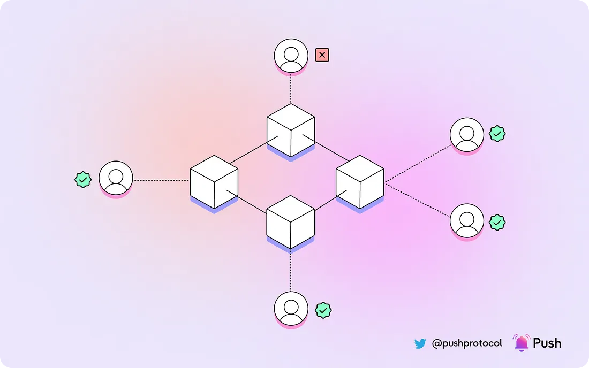

<!--truncate-->

<!--customheaderpoint-->

# An Introduction to Push Notification: Part 2.3 

The metaverse without communication is counter-intuitive. Users are disconnected when connecting to digital assets and worlds; Push Protocol aims to change that. With the current web3 experience, it is not practical to expect meaningful and valuable interactions without a robust communication method.

## Recalling the Metaverse: A Participatory Digital Society

The metaverse is an ambiguous idea and does not necessarily have to depend on a blockchain to exist. However, metaverse-based projects that use blockchain as their underlying infrastructure lack a means for communication. This necessary component is needed to deliver the intended socio-economic potential of the metaverse.

The metaverse can be interpreted in many ways and analyzed through different disciplines. Still, in general, the metaverse attempts to redefine how we interact and transact with one another through a participatory digital society. The metaverse requires a novel communication method that allows us to become active participants in the said digital society.

The two key things we mentioned here:

- The socio-economic potential of the metaverse requires a means of communication.
- Communication within the metaverse allows us to become participants in a digital society.

## Meta-communication in the Metaverse

Push Protocol is ready for meta-communication. As a universal and chain-agnostic protocol, Push can be used as the communication mechanism to send messages and real-time updates about activity in the metaverse. Digital entities within the metaverse can cross-communicate with one another. Creators can benefit from the frictionless experience of Push by forming direct communication channels with their audiences. Users can schedule actions in the metaverse based on automatic updates fostered through Push. Becoming the native communication layer means that Push protocol taps into multiple platforms, implementing meta-communication across the metaverse and web3.

A project that recently integrated Push into their metaverse tech stack was [Decentraland](https://medium.com/u/98348dd48afe?source=post_page-----7efbda6d9b80--------------------------------), a virtual destination for digital assets. Decentraland contains a DAO that drives the direction of the virtual land. Users can propose all sorts of additions and improvements through the DAO. For instance, a user may want to add an example of the Eiffel tower at a specific location on the virtual land. The challenge is that other users must constantly check the latest proposals and continuously engage with the platform to raise their opinion and vote. With Push Protocol, the DAO can trigger a notification that broadcasts to all subscribed users through a dedicated Decentraland DAO communication channel about the Eiffel tower proposal. The image below illustrates this scenario:

Consider another example, this time based on managing your digital assets. You’ve listed an NFT for trade in a metaverse marketplace and aren’t aware of the offers being made. Nor are you aware of the general market or anything beyond what you already know about your potential trade. With push notifications, the marketplace can send you a message each time certain activities occur on-chain, such as another user bidding on your NFT.

## How Can We Push NFTs?

Many of us have been to web3-based events and received an NFT for attending or participating. Imagine you have just attended a speculator workshop about one of your favorite crypto projects and received an NFT for being a participant. You’re excited to look back at the NFT the next time you open your wallet as a way to connect with your cool experience.

## Engage with Users

But, it usually stops there. The NFT is lonely and picking up digital dust, staying static at your address. Imagine the NFTs could talk to each other. Based on specific data queries on addresses that hold NFTs as part of the same collection, users can push messages to each other’s wallets. NFTs can also notify users about how other NFTs are being used.

And we can consider the other perspective with the NFT provider(s): wouldn’t it be great to have a method of communication to keep in touch with participants, community members, and contributors instead of closing the doors on each other after they’ve left your event? Your team just ran an excellent crypto event and managed to give out more than 200 NFTs to participants. While you’re stoked about the successful event you ran, you know that after the participants mint their NFTs, they will sit in their wallets, gathering dust, and the interactions between you and them likely won’t exist. The diagram below shows an example of how Push protocol can communicate with NFT holders and establish a connection as long as they’d like to subscribe.

<i>The metaverse and the digital assets within the blockchain space have proclaimed a message without being able to message: we need decentralized communication middleware, and Push Protocol offers just that.</i>  

While we named a few use cases in this article that relate to the metaverse and NFTs, there are plenty more, and we encourage you to start building yourself!

<i>By Danny Salman</i>
