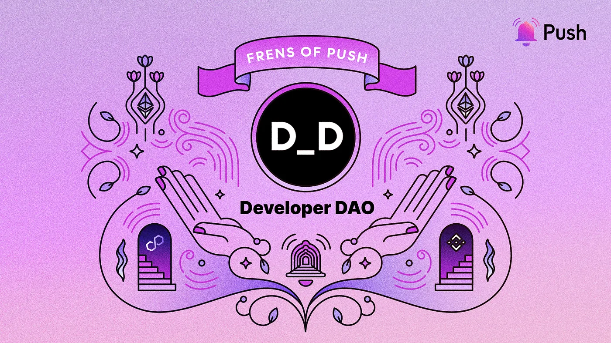

<!--truncate-->

# Frens of Push #6 | This week, our featured Fren is one of the biggest developer communities in web3, Developer DAO🎉

<i>
    <a href='https://medium.com/push-protocol/tagged/frensofpush'>"Frens of Push"</a> is our weekly content series to spotlight outstanding projects that are building with Push. If you want to be featured, reach out to us and you could be our next Fren in the series.
</i>

Since its conception, the goal of [Developer DAO](https://www.developerdao.com/) has been to onboard, educate, and support web3 developers with all the tools they need to successfully build the next generation of web3 projects. With over 5,000+ members from around the world, it’s safe to say the Developer DAO mission to accelerate the education and impact of a new wave of web3 builders has been widely accepted.

For a DAO that relies on the participation of its members to operate effectively, communication remains an integral component. By [integrating Push Notifications](https://medium.com/push-protocol/developer-dao-x-push-enhancing-ux-through-web3-communication-tools-7538b5656d43), the D_D community can now enhance its communication capacities and hence UX, by enabling members to better stay updated on the latest governance proposals, forum topics, and other important updates.

In this episode of “Frens of Push”, we are in conversation with [Krinza](https://twitter.com/kayprasla) from Developer DAO to talk about how Push’s communication layer is powering the D_D community.

### Hi Krinza, how did you become involved in building in the blockchain space? What’s your story?
Krinza: Before joining web3 full-time, I was working in my capacity as a data scientist building AI products. My first year working in that role was all fun and games until the work started to feel redundant. It was no longer about the thrill of solving a problem anymore, but the drudgery of making the exact pipelines run in similar ways or applying them to different problems.

This made me start exploring blockchain in my spare time. I was already enveloped in crypto and had explored the NFT space to its fullest. Yet, it was really when I joined the Developer DAO earlier in March 2022 that things started to pull me down the rabbit hole and I became hooked to web3.

Now I work for this project called 
Ankr, where we are building a decentralized multichain web3 infrastructure and dev tools for developers and enterprises to experience the potential of blockchain without doing any heavy lifting themselves.

### Tell us about Developer DAO — what’s it about, and what problem does D_D solve?
Krinza: Developer DAO is a tokenized community of web3 builders and developers. We’re all about creating public goods, offering educational opportunities, and helping developers level up their careers.

<blockquote><i>One of the main problems that Developer DAO solves is the lack of resources and support for new web3 developers to explore and build in this space. DevDAO has been a soft ground for most of us in kickstarting our careers in web3.</i></blockquote>

### What’s your 2023 plan for D_D?
Krinza: 2023 plan for Developer DAO is to keep on contributing to the organization’s growth and development while ensuring we engage with members outside of the community and give them a platform to learn and grow with us. This will happen through a couple of initiatives we are launching this quarter that will get builders to attend their first hackathons (Build Scholarships), get the right kind of resources and mentorship (DevRel Incubation), and eventually full-time jobs in web3 (DevDao Jobs).

### How is D_D using Push’s web3 communication layer?
Krinza: We have recently plugged Push Protocol to add another layer of notification, and we’re super excited to see all the awesome ways we can use it. Right now, we’re thinking about sending notifications for things like new proposals on Snapshot and new topic creations on our forum. But we can also think about reminder pings for when proposal voting is about to end and notifications for our newsletter and new blog posts on DevDAO Hashnode. The possibilities are endless, and we can’t wait to see what we come up with!

### How would you describe your experience using Push? What benefits have you seen?
Krinza: The experience with Push has been smooth, which has allowed us to make the community members informed of the on-chain activities. It is easy to integrate and offers many benefits to bring the community together in a much more secure manner.

Special shout-out to Harsh, Fabio, and Jun for always being available to engage with the DevDAO community.

### What cool use cases do you see Push being used for in the future?
Krinza: Supporting more chains, and eventually onboarding more ecosystems!

### What do you usually do (for fun) besides web3? :)
Krinza: Ah — lots of random things. I’ve recently started to skip rope and of course more traveling.

Thank you so much Krinza. You’re truly awesome! We can’t wait to see how this journey goes for D_D and Push.

About Developer DAO
DevDAO is a community of web3 builders working towards creating a better internet. D_D exists to foster a new wave of web3 builders, tools, and public goods.

Find more about D_D: [Website](https://www.developerdao.com/), [Twitter](https://twitter.com/developer_dao/), [YouTube](https://www.youtube.com/c/DeveloperDAO), [GitHub](https://github.com/Developer-DAO), [Discord](https://discord.com/invite/devdao)

### About Push Protocol

Push is the communication protocol of web3. Push protocol enables cross-chain notifications and messaging for dapps, wallets, and services tied to wallet addresses in an open, gasless, and platform-agnostic fashion. The open communication layer allows any crypto wallet /frontend to tap into the network and get the communication across.

To keep up-to-date with Push Protocol: [Website](https://push.org/), [Twitter](https://twitter.com/pushprotocol), [Telegram](https://t.me/epnsproject), [Discord](https://discord.gg/pushprotocol), [YouTube](https://www.youtube.com/c/EthereumPushNotificationService), and [Linktree](https://linktr.ee/pushprotocol).