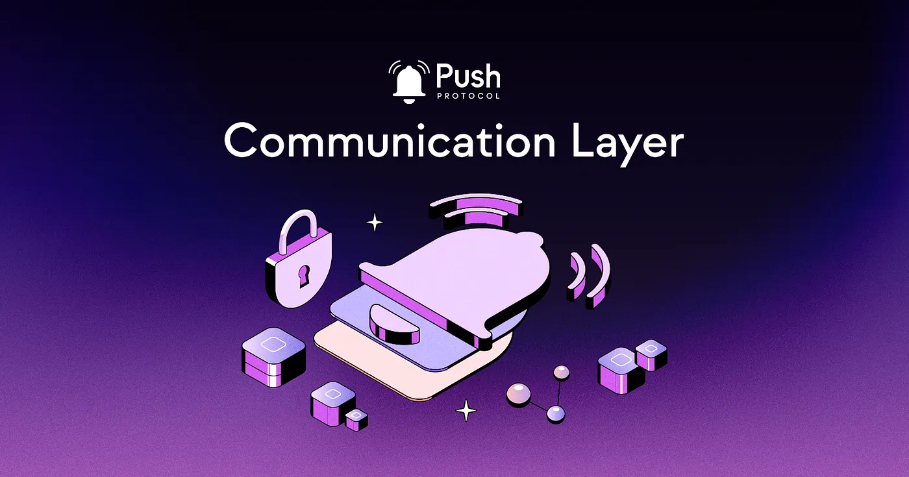

Decentralized communication is a hot topic in the web3 space as more and more developers are looking to build dapps that can function independently of any single central authority.

<!--truncate-->

Though, a key component of building a successful dapp is providing a communication layer that is both decentralized and universal.

A decentralized communication layer does not rely on any central server or authority. Instead, it depends on a distributed network of nodes to handle and route data between users. This ensures communication is resistant to censorship, tampering, and other forms of interference, as well as be able to function even if some nodes go offline.

In this way, a universal communication layer is accessible to all users regardless of their device or platform. This is essential in the web3 space, as users will often have a variety of different devices and platforms that they need to interact with to access and use a dApp.

## What does it take to build a web3 communication layer?
In general, to build a decentralized and universal communication layer, several vital components are required, including:

- <b>Robust Network Architecture:</b> The network architecture of a decentralized communication layer must be designed to ensure that data can be reliably and efficiently routed between nodes, even in the event of node failures or network congestion.
- <b>Data storage:</b> Decentralized communication systems typically rely on distributed data storage to ensure that data is stored redundantly across multiple nodes, making it less vulnerable to data loss or corruption.
- <b>Consensus:</b> A consensus mechanism ensures that all nodes in the network agree on the system’s state. This is particularly important in decentralized systems, as there is no central authority to ensure that all nodes are in sync. Network maintainers must verify and finalize message data for a communication layer to function.
- <b>Security:</b> Securing a decentralized communication system is a significant concern, as there are a variety of potential attack vectors that could be used to compromise the security of the system. A communication layer must consider encryption and authentication mechanisms to ensure the safety of the users’ data.
- <b>Interoperability:</b> A universal communication layer must interact seamlessly with various devices and platforms, so a communication protocol needs to ensure that the system can handle different data formats and protocols.
- <b>Composable:</b> A communication layer must be able to adapt to a variety of conditions and improve as required. This includes the incorporation of new technologies and web-based systems.

With these components, a web3 communication layer can offer censorship-resistant, privacy-preserving, and spam-protected communication while being chain-agnostic, gasless, and scalable

## Are we still Pushing? We’re always Pushing.
Building a decentralized communication layer is a process, not a product, meaning it’s not something that can be fully achieved but rather something that requires consistent development.

The team at [Push Protocol](https://push.org/) is continuously working on improving its architecture by crafting and refining the key components for building a communication layer. With a strong focus on security and performance, Push is working to bring the best decentralized communication tools possible to the web3 space.

As a result, the Push Protocol community continues to rapidly evolve and is getting closer to reaching its goal of enabling millions of users and devices to communicate simultaneously across web3. Push brings novel communication capabilities to the decentralized world with real-time messaging, efficient message dissemination, and interoperability, allowing it to become the communication standard for dApps.

Stay tuned! In upcoming posts, we’ll delve into the technical details with each component, from peer-to-peer networking to message verification.

Pssssssst 🤫

Thanks for making it this far.

If you’re interested in exploring how Push Notifications or Push Chat can boost user engagement and benefit your project, check out:

- [Our Discord](https://discord.gg/pushprotocol) — we’ve got devs ready to give your project whatever support and consultation you need.
- [Push developer docs](/docs/) to get started on building right away!

### About Push Protocol

Push is the communication protocol of web3. Push protocol enables cross-chain notifications and messaging for dapps, wallets, and services tied to wallet addresses in an open, gasless, and platform-agnostic fashion. The open communication layer allows any crypto wallet /frontend to tap into the network and get the communication across.

To keep up-to-date with Push Protocol: [Website](https://push.org/), [Twitter](https://twitter.com/pushprotocol), [Telegram](https://t.me/epnsproject), [Discord](https://discord.gg/pushprotocol), [YouTube](https://www.youtube.com/c/EthereumPushNotificationService), and [Linktree](https://linktr.ee/pushprotocol).
