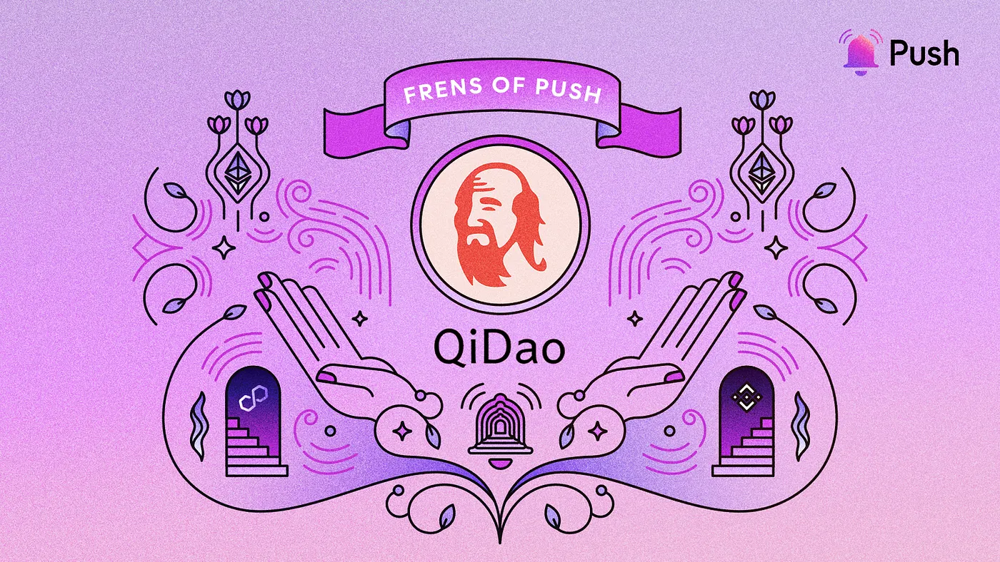

<!--truncate-->

<!--customheaderpoint-->
# Frens of Push #7 | This week, our featured Fren is one of the leading stablecoin protocols, QiDAO🎉

<i>
    <a href='https://medium.com/push-protocol/tagged/frensofpush'>"Frens of Push"</a> is our weekly content series to spotlight outstanding projects that are building with Push. If you want to be featured, reach out to us and you could be our next Fren in the series.
</i>

This week, we’re delighted to have on a leading decentralized stablecoin protocol and our fren, QiDao, to talk about their journey with Push.

A bit about [QiDao](https://www.mai.finance/). How do you keep your crypto assets while still being able to spend their value? QiDao stablecoin protocol allows you to lock your tokens out of circulation and be used as collateral to borrow stablecoins. As a borrowing and lending protocol, QiDao is self-sustained, community-run, and completely decentralized.

For a borrowing protocol, updating its users about their debt positions is immensely important to keep their positions from liquidating. This is where Push steps in. By sending Push notifications directly to users, QiDao is able to update users about the health of their debt positions, thereby preventing potential losses.

In this episode of ‘Frens of Push’, we sat down with [Benjamin](https://twitter.com/Benjamin918_) from QiDao to talk about the problem QiDao is trying to solve, their vision, and their journey with Push.

### Hi Benjamin, how did you first get involved in building in the blockchain space? What’s your story?
<b>Benjamin:</b> I’ve been in crypto for a few years now. Started launching some infrastructure projects in early blockchains. When the DeFi movement really started, that became more of my focus.

### Tell us about QiDao — what’s it about, and what problem does QiDAO solve?
<b>Benjamin:</b> QiDao is a stablecoin protocol that allows you to mint MAI against the value of your tokens. What makes MAI special is that you can mint it natively against your favorite collaterals on your favorite chains. As a result, you don’t have to trust bridges to access stablecoins. You can create them on your chain.

Additionally, MAI loans are 0% interest, so your debt amount does not change. QiDao only charges a 0.5% repayment fee, which stays constant in value no matter when you repay.

### What’s your 2023 plan for QiDao?
<b>Benjamin:</b> We have a ton planned for 2023. Here are the 3 I’m most excited about.

A stability pool to liquidate debt positions at QiDao will soon be rolled out. This will offer MAI holders a new yield opportunity that won’t rely on inflationary tokenomics. It will also have a component for arbitrageurs to buy collateral assets with MAI at a fixed MAI price of $1.

Liquidation-protected vaults. Our team is working on vaults that will protect users from being liquidated. What’s interesting about this product is that it will be fully onchain, unlike alternative liquidation protection products.

We’re one of a handful of protocols alpha-testing Chainlink’s brand new CCIP — a cross-chain messaging system. QiDao will likely use this for cross-chain governance and improved bridging.

### How is QiDao using Push’s web3 communication layer?
<b>Benjamin:</b> When users take loans in crypto, they have to be very careful to maintain the collateralization of their debt position. Otherwise, those debt positions can be liquidated.

At QiDao, we use Push so that users can stay up to date with the health of their debt positions. This can help prevent unnecessary user losses. In general, users trust Push given their OG status in crypto and their amazing track record.

### How would you describe your experience using Push? What benefits have you seen?
<b>Benjamin:</b> It’s amazing! We had people tell us for months that they wanted this integration so it’s great to have this utility. What’s best is that it’s simple to use. And that’s what has brought so many of our users to the platform.

### What cool use cases do you see Push being used for in the future?
<b>Benjamin:</b> What Push is really good for is keeping people’s attention. Because normally you exit a dapp and that’s it- no more engagement. Take a look at sites like Twitter, which are always trying to get you back. Push can be a powerful tool for user engagement.

Thank you, Benjamin, for taking the time to speak with us. We look forward to accelerating your growth and helping bring value to your users.

## About QiDao
QiDao is Polygon’s first native stablecoin protocol (and is now supported by multiple chains) that functions on an over-collateralized debt position model. The protocol allows its users to borrow $MAI or miMatic stablecoin against their decentralized token collaterals.

Find out more about QiDao: [Website](https://app.mai.finance/), [Twitter](https://twitter.com/QiDaoProtocol?ref_src=twsrc%5Egoogle%7Ctwcamp%5Eserp%7Ctwgr%5Eauthor), [Discord](https://discord.com/invite/mQq55j65xJ), [Docs](https://docs.mai.finance/introduction-1)

### About Push Protocol

Push is the communication protocol of web3. Push protocol enables cross-chain notifications and messaging for dapps, wallets, and services tied to wallet addresses in an open, gasless, and platform-agnostic fashion. The open communication layer allows any crypto wallet /frontend to tap into the network and get the communication across.

To keep up-to-date with Push Protocol: [Website](https://push.org/), [Twitter](https://twitter.com/pushprotocol), [Telegram](https://t.me/epnsproject), [Discord](https://discord.gg/pushprotocol), [YouTube](https://www.youtube.com/c/EthereumPushNotificationService), and [Linktree](https://linktr.ee/pushprotocol).

<i>
    “Push frens” is our weekly content series to spotlight outstanding projects building with Push. If you want to be featured, reach out to us, and you could be our next Fren in the series.
</i>

