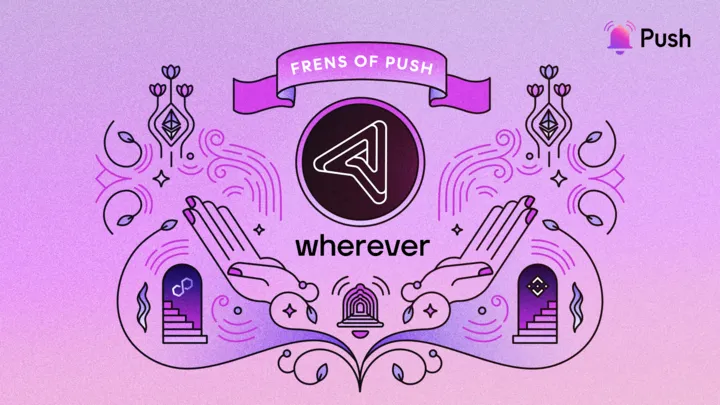

---

slug: push-and-wherever-team-up-to-bring-web3-communication-tools-to-dapps
title: 'Push and Wherever Team Up to Bring Web3 Communication Tools to Dapps🛠️'
authors: [push]
image: './cover-image.webp'
tags: [ Frensofpush, Web3, Blockchain, Blockchain Technology, Push Notification]

---

This week, our featured fren is a wallet-first customer communication platform, Wherever 😊

Imagine wallet-to-wallet communication on dapps that protects users’ data and privacy, all the while ensuring they get the best possible experience. That’s Wherever for you. The platform enables web3 dapps to communicate with wallets directly, no matter where they are. Communication wherever, literally!

<!--truncate-->

By way of this collaboration, Push provides Wherever the infrastructure to facilitate wallet communication with an emphasis on personalization, automation, and user experience. Wherever relies on Push’s communication layer to deliver in-app notifications while ensuring a decentralized relay and storage.

In this episode of “Frens of Push”, Amos joins us to talk about how the pilot collaboration between Push and Wherever has the potential to disrupt web3 communication.

## Hi Amos, how did you become involved in building in the blockchain space? What’s your story?
<b>Amos:</b> Before I started working on Wherever, I founded an airline communication startup, helping the biggest airlines in the world communicate with their passengers during flight disruptions. Working with web2 communication infrastructure at a large scale really showed me how fragmented and antiquated it is. Dominated by either siloed walled gardens or out-of-date messaging protocols, the digital communication space was broken. In search of other alternatives, I came across the potential of web3 to disrupt this huge space and decided that I have to join this revolution. And so together with my two amazing friends and co-founders, Niv Oppenhaim and Ido Goldberg, we started Wherever on a mission to help create an internet where users can communicate with anyone from wherever.

### Tell us about Wherever — what’s it about, and what problem does Wherever solve?
<b>Amos:</b> Wherever is a wallet-first communication platform. We help web3 projects communicate directly with wallets, wherever they are. Today, dapps and communities struggle to rise above the noise on Twitter and Discord, lacking a more personalized channel with their users. On top of the clutter, the web3 identity gap forces projects to “spray and pray” in these web2 platforms, engaging users without understanding their on-chain activity and ownership.

Wherever provides product and community managers with the tools to grow a direct web3 communication channel with their users, and leverage web3 messaging protocols to send messages directly to their wallets. Our platform is comprised of three main components — Subscriber Growth tools, Broadcasting Studio, and Web3 Inbox.

Growth tools are basically APIs, widgets, and Discord bots that help collect web3 subscribers and enable them to connect web2 channels, such as email and Telegram, without compromising their privacy. In the Studio, marketers can broadcast personalized campaigns directly to their users’ wallets based on their digital ownership, and PMs can use our no-code builder to create automated notifications based on the users on-chain activity. Lastly, we enable dapps and Wallet Apps to embed a web3 inbox and empower their users to tap into decentralized and secure messaging.

### What’s your 2023 plan for Wherever?
<b>Amos:</b> First, we believe that 2023 will be the year of wallet-to-wallet communication! Every project in the space will add web3 native messaging channels to build trust with their users, drive engagement, and foster stronger relationships.

We’ll be focusing this year on helping dapps onboard their users to this next-gen digital communication, and leverage the messaging protocols to send the right message, at the right time, to the right wallet. Furthermore, we will be introducing cool new ways to create wallet-first loyalty & ambassador programs, user research surveys, customer support, airdrops, and more!

### How is Wherever using Push’s web3 communication layer?
<b>Amos:</b> Wherever leverages Push’s communication layer to send messages directly to users’ wallets. Push enables us to focus on personalization, automation, and UX while they provide the infrastructure to manage the relay and storage of the messages. Together, we are able to offer any web3 project a communication experience that is on par with web2 but completely decentralized and interoperable. This unlocks a completely new and radically different experience — your inbox, wherever you go!

### What cool use cases do you see Push being used for in the future?
<b>Amos:</b> Interactive Messages! Besides interoperability and this notion of “your inbox, wherever”, interactive messaging could be web3’s killer feature. As Gabby Goldberg coined it, “talking to the protocol”, means that the recipient of the message is the protocol itself. Interactive Messages would enable users to do almost everything through the chat interface — send money to a friend, submit an NFT offer, or vote on a new DAO proposal. This will take web3 from “being on par with web2”, to “kicking web2 in the a**”!

### How would you describe your experience using Push? What benefits have you seen?
<b>Amos:</b> The experience so far has been great! We look forward to collaborating and helping more web3 projects leverage the Push protocol to engage their users in more delightful ways. Shoutout to Madeline and Richa for being such great partners to us!

___

Thanks Amos for the awesome conversation. Hope to revolutionize web3 communication together!

About Wherever
Wherever is a wallet-first customer communication platform, designed to help dapps establish wallet-to-wallet communication with their users without requiring them to compromise their experience or privacy.

Find more about Wherever: [Website](https://wherever.to/), [Twitter](https://twitter.com/wherever_im), [Docs](https://docs.wherever.to/main/)

<i>
“Push frens” is our weekly content series to spotlight outstanding projects building with Push. If you want to be featured, reach out to us, and you could be our next Fren in the series.
</i>