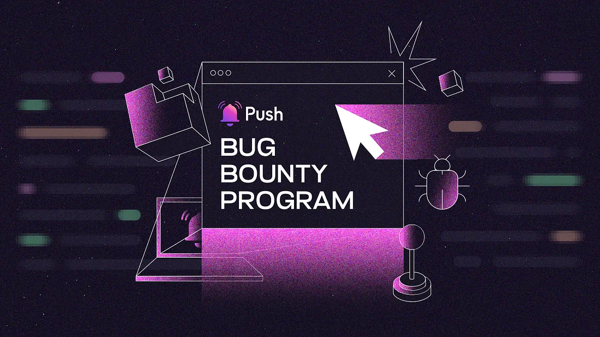

---

slug: push-protocol-s-bug-bounty-program-goes-live
title: Push Protocol’s Bug Bounty Program Goes Live!
authors: [push]
tags: [ Web3, Bug Bounty, Blockchain Technology, Bounty Program, Announcements]

---

Its official! The Push DAO has ratified the proposal to implement Push Protocol’s Bug Bounty Program🎉

<!--truncate-->

<b>And the program starts TODAY!</b>

## How the Program works

The Program is structured to be as streamlined as possible by following just 3 steps:

- <b>Step 1:</b> Security researchers will submit their findings through the Official Form available <a href="https://zv9atndluia.typeform.com/to/KW3gwclM"><b>here</b></a>.
- <b>Step 2:</b> Designated Push Team members will review security vulnerabilities, analyze the report, and classify it according to severity.
- <b>Step 3:</b> The Push team will follow up with the reporter with results in no more than 1 week.

The program includes 4 levels of severity on its scale:

- <b>Critical Issues</b> — have a serious and immediate impact in the protocol functioning and could impact numerous users. An example would be preventing notifications and/or chat from being sent, or affectation to fees collected through the protocol.
- <b>High Issues</b> — pose severe risks to individual users or Push’s partners.
- <b>Medium Issues</b> — where the risk is relatively small and does not jeopardize users/protocols that interact with Push.
- <b>Low/Informational Issues</b> — do not pose an immediate risk but are relevant to security best practices.

Rewards will be given based on the classification of the bug’s severity, as well as the likelihood of the bug being triggered or exploited. This is to be determined at the sole discretion of the Push Protocol team.

## Eligibility requirements

To be eligible for a reward, you must comply with all the eligibility requirements of the Program outlined below.

- Discover a previously unreported, unknown, non-public vulnerability to the team which is within the scope of this Program.
- Be the first to disclose the unique vulnerability — via the form that will be made available after this proposal is ratified, in compliance with the disclosure requirements.
- Provide sufficient information to enable our engineers to reproduce the vulnerability and fix it.
- Not exploit the vulnerability in any way. This includes sharing the vulnerability with others and/or by obtaining an additional reward, other than a reward under this Program.
- Not publicize the vulnerability in any way, other than private reporting to us.
- Make a good faith effort to avoid privacy violations, destruction of data, interruption or degradation of any of the assets in scope.
- Not submit a vulnerability caused by an underlying issue that is the same as an issue previously reported and paid out by the Program.
- Not engage in any unlawful conduct when disclosing the bug. This includes threats, demands, or any other coercive tactics.
- Be at least 18 years of age. If younger, submit note of the vulnerability along with written consent of your parent or guardian.
- Not be a current or former Push team member, vendor or contractor who has been involved in the development of the code of the bug in question.

<b>.   .   .</b>

The Push DAO Bug Bounty Program will be managed in epochs of <b>3 months</b> (officially starting on day 1 of each quarter).

Fund allocation per epoch may vary according to market conditions. Despite this, Push DAO will always ensure some extent of funding is allocated to sustain rewards for contributors.

This newfound Bug Bounty Program adds to our long string of initiatives that aim to foster and encourage community participation.

We look forward to seeing your contributions and support in making Push as great a protocol as possible!

## Got questions?

You can reach out to us through any of our communication channels, however we suggest Discord as the initial point to start conversations and ask questions regarding vulnerabilities found.

You can find us on [Discord here](https://discord.com/invite/pushprotocol).

Thanks again for being a part of what makes Push Protocol incredible!

### About Push Protocol

Push is the communication protocol of web3. Push protocol enables cross-chain notifications and messaging for dapps, wallets, and services tied to wallet addresses in an open, gasless, and platform-agnostic fashion. The open communication layer allows any crypto wallet /frontend to tap into the network and get the communication across.

To keep up-to-date with Push Protocol: [Website](https://push.org/), [Twitter](https://twitter.com/pushprotocol), [Telegram](https://t.me/epnsproject), [Discord](https://discord.gg/pushprotocol), [YouTube](https://www.youtube.com/c/EthereumPushNotificationService), and [Linktree](https://linktr.ee/pushprotocol).