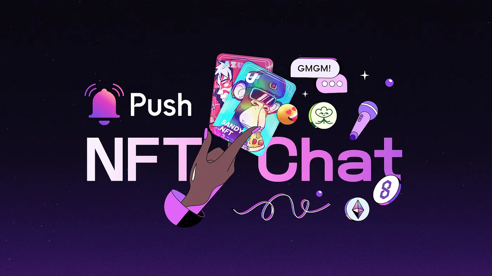
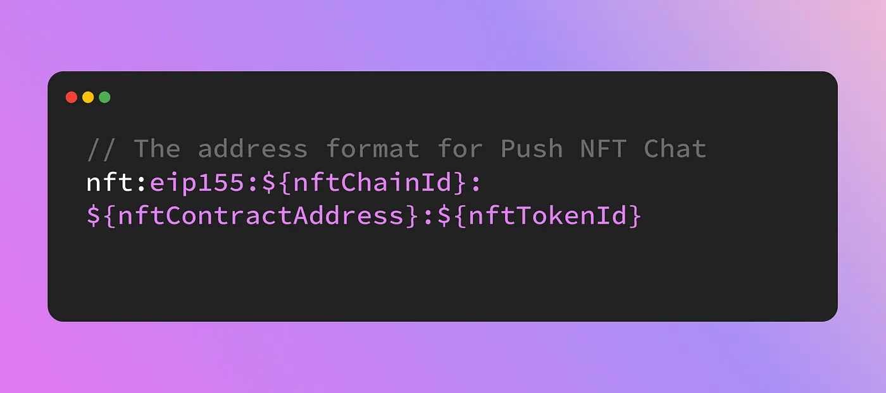

<!--customheaderpoint-->
# Instantly integrate Push NFT Chat for pure NFT-to-NFT chat

We are thrilled to announce the highly anticipated release of Push NFT Chat, the next leap in web3 messaging. For the 1.5 Million+ NFT wallets and NFT collections like Azuki, BAYC, CryptoPunks, a universe of new potential utility is now here for your collections 🌎

<!--truncate-->

As the team behind Push Protocol, we’ve been committed to pushing the boundaries of what is possible in web3 through decentralized communication. With our previous product, Push Chat, we successfully introduced native web3 instant chats using wallet addresses. Push Chat boasts a number of user-centric features like spam control, inbuilt notification modules, video and audio calls and [much more](https://push-protocol.medium.com/launching-the-future-of-web3-messaging-with-push-chat-push-group-chat-de4cb7a65231).

Today, we’re taking Push Chat innovation to an entirely new level with the launch of Push NFT Chat. Built as an extension of Push Chat, Push NFT Chat benefits from all the intuitive, user-centric features that Push Chat has while revolutionizing the way NFT holders interact. By introducing web3 native NFT-to-NFT and dApp-to-NFT instant communication, we’ll be adding to the suite of enhancements that the recently launched [ERC-6551](https://eips.ethereum.org/EIPS/eip-6551) is also bringing to NFTs in web3.

How does Push NFT Chat specifically differ from Push Chat on a functional and security level? Read on to find out.

## Introducing Push NFT Chat
Push NFT Chat enables chats to be tied to a specific NFT owned by you, instead of a chat owned by a wallet address. It operates just the way Push chat operates for wallets and <b>includes all features you can find in Push chat</b> but with three main differences:

- It uses triple encryption to ensure your chats are truly tied to an NFT and not a wallet alias.
- The address format for Push NFT Chat is <b>nft:eip155:${nftChainId}:${nftContractAddress}:${nftTokenId} instead of eip155:${walletaddress}</b> (used in wallet to wallet communication)
- Your communication moves with your NFT but only if you want them to

<blockquote>
<i>Developer Hint</i>: Push NFT Chat is already out:

https://www.npmjs.com/package/@pushprotocol/restapi#for-chat

<i>Developer Hint</i>: This example repo covers all functionalities that can be implemented from the SDK:

https://github.com/ethereum-push-notification-service/push-sdk/tree/main/packages/examples/sdk-backend-node
</blockquote>

## How does Push NFT Chat work?
The message abilities and features of Push NFT Chat are still based on PGP keys that power wallet-to-wallet Push Chat and are encrypted and stored on Push Network to enable an E2EE universal inbox. However, there are different features that enable Push NFT Chat, tie communication to the NFT, and validate it.

### Encryption
Push NFT Chat uses a different encryption mechanism to encrypt the PGP key. This is what makes it secure yet versatile to support NFT chats. Push NFT Chat uses three pass encryption and is done in the following way for a new user:

- A secret key is randomly created for the user on client side, this is automated by SDK and invisible to the user though their are options available for a user to choose the secret key if they want.
- This secret key is then used to encrypt the PGP key generated locally on the client side.
- This secret key is then encrypted by the wallet of the user and the encrypted version of it and the encrypted PGP key is stored on the Push nodes.

This approach still results in the default behavior of signing once to unlock Push Profiles and start messaging, though it is now also capable of supporting chat and connections transfers when and if you move your NFT to another wallet.

This is enabled because of the three pass encryption which means your PGP keys can be decrypted and re-encrypted by a user if they have access to the secret key. Since the key itself is encrypted by the current wallet which holds that NFT, the decryption process doesn’t require manually entering the secret key as wallet signing is used to derive the decrypted secret key.

This creates an intuitive UX where user is not hassled by the experience while still gaining the crucial feature of truly connecting their chats and connections with the NFT.

## Address Format
Apart from the way encryption is handled, the NFT chat uses a different address format for communication owing to them having access to various NFTs from the same wallet. The address format is <b>nft:eip155:${nftChainId}:${nftContractAddress}:${nftTokenId}.</b>

<blockquote>
 <i>For example:</i>Lens NFT Chat will result in the address format as nft:eip155:137:0xDb46d1Dc155634FbC732f92E853b10B288AD5a1d:44433
</blockquote>

Each address format representing identifiers as follows:

1. <b>nft</b> -> To segregate whether chat profile is for wallet or nft
2. <b>eip155</b> -> Identifier for all EVM chains as per CAIP10, in the future other blockchain identifiers (non-Ethereum ones) will also be supported
3. <b>${'nftChainId'}</b> -> Chain id on which the NFT is present, in case of Lens, it’s on Polygon whose chain id is 137
4. <b>${'nftContractAddress'}</b> -> The contract address of the NFT, in case of Lens, it’s contract address for NFT is 0xDb46d1Dc155634FbC732f92E853b10B288AD5a1d
5. <b>${'nftTokenId'}</b> -> The token id of the particular NFT held by the wallet of the user, in this example, we have taken that as 44433

## Transferring the NFT
The key pair is encrypted by a secret key selected by the NFT holder. When the NFT holder decides to transfer the NFT to another user, two possible scenarios can occur:

- In the first scenario, the original owner can choose to send the new owner the secret key. This allows the new owner to decrypt all the chat messages associated with the NFT. This option ensures the continuity of the chat messages within the NFT.

<blockquote>
The original owner doesn’t have to remember or even decide this secret on creation as that can handled by the frontend or the SDK including encrypting it with your wallet (though the user is free to override it).
</blockquote>

- In the second scenario, the new owner doesn’t have a secret key at which point the NFT profile is created afresh. However, this means that the new owner will not have access to any previous chat messages linked to that NFT. This option prioritizes the security of the chat messages and ensures that no one else has access to them.

<blockquote>
These two options enable pure, native NFT chat that is truly tied to a user NFT without sacrificing the security or the ability of transferring communication and connections. Instead, giving the control back to the user to decide what they want to do with their communications that they did with their NFT.
</blockquote>

## Guide for Getting Started With Push NFT Chat
To integrate with Push NFT Chat, you can start by watching the live demo below.

<iframe width="100%" height="382" src="https://www.youtube.com/embed/Im_5RRQyQP4" title="Introducing Push NFT Chat | Live Demo" frameborder="0" allow="accelerometer; autoplay; clipboard-write; encrypted-media; gyroscope; picture-in-picture; web-share" allowfullscreen></iframe>

Begin Building 👉 https://www.npmjs.com/package/@pushpr...

Push SDK Repo 👉 https://github.com/ethereum-push-noti...

If you need any help or support with integration, give us a shout out or tag us on [Discord](https://discord.gg/Ar8HkYNs).

### About Push Protocol

Push is the communication protocol of web3. Push protocol enables cross-chain notifications and messaging for dapps, wallets, and services tied to wallet addresses in an open, gasless, and platform-agnostic fashion. The open communication layer allows any crypto wallet /frontend to tap into the network and get the communication across.

To keep up-to-date with Push Protocol: [Website](https://push.org/), [Twitter](https://twitter.com/pushprotocol), [Telegram](https://t.me/epnsproject), [Discord](https://discord.gg/pushprotocol), [YouTube](https://www.youtube.com/c/EthereumPushNotificationService), and [Linktree](https://linktr.ee/pushprotocol).

