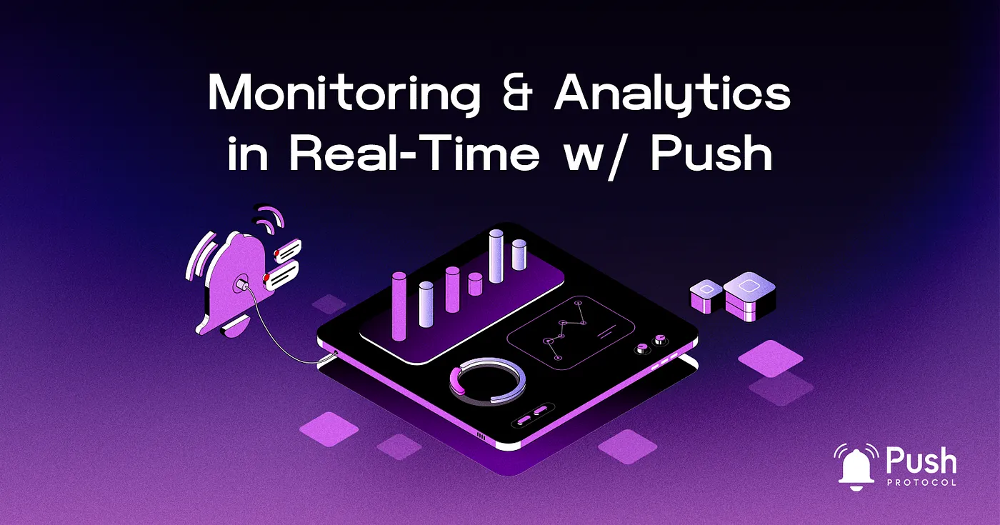

<!--truncate-->

In today’s fast-paced business environment, accessing and analyzing data in real-time is critical to making informed decisions. Push Protocol is a powerful tool that can help organizations achieve this goal by providing a way to receive real-time data updates as soon as they become available.

As businesses and organizations rely on vast amounts of data to make informed decisions, real-time monitoring and analytics have become increasingly important. Push Protocol is at the forefront of this revolution, offering a unique solution that harnesses the power of blockchain data, analytics, and big data to enable better communication and coordination.

In this blog post, we will explore how Push Protocol can revolutionize data-driven decision-making by providing real-time monitoring and analytics capabilities.

## Current Landscape of Analytics and Monitoring
### Traditional data processing and communication:
- Typically, analytics and monitoring solutions rely on batch processing, which involves collecting and analyzing data at specific intervals. This method can result in delays in decision-making, as insights are not immediately available to users.
- Traditionally, data has been pulled from various sources at pre-determined intervals, resulting in delays between the time the data is generated and the time it is analyzed. This approach can be inefficient and time-consuming, limiting an organization’s ability to make timely and informed decisions.
### Notification systems:
Current notification systems often send users emails, SMS, or in-app alerts when a particular event or threshold is reached. While these methods can be effective, there might be instances where the delivery of notifications varies, leading to potential delays or missed critical updates.
## How Push Protocol Enhances Real-Time Monitoring and Analytics
Push Protocol enables real-time monitoring and analysis by maintaining a persistent connection between data sources and recipients. This approach allows organizations to make faster decisions, efficiently allocate resources, and quickly identify trends or anomalies in data.

For example, in the Web3 ecosystem, a dApp using Push Protocol can swiftly detect traffic spikes, scale infrastructure accordingly, and address potential security breaches or sudden surges in user activity. By providing real-time updates, Push Protocol empowers businesses to make informed decisions and stay ahead in the fast-paced, competitive world of Web3.

- <b>Real-time communication:</b> Push Protocol facilitates instantaneous and real-time communication between parties, allowing for seamless coordination and faster decision-making. By enabling immediate data exchange and updates, Push Protocols empower users with up-to-date insights, enhancing the speed and accuracy of decision-making processes.
- <b>Customizable and context-aware notifications:</b> Push Protocol enables the creation of customizable and context-aware notifications, ensuring that users receive relevant and timely alerts. This helps users prioritize critical updates and take action as needed.
- <b>Integration with analytics tools and platforms:</b> Push Protocol can easily integrate with various data sources, tools, and platforms, providing a unified solution for real-time monitoring and analytics. This allows organizations to leverage existing analytics infrastructure and tools while benefiting from the real-time capabilities offered by Push Protocol.
## Real-World Applications of Push Protocol in Data-Driven Decision Making
With its inherent adaptability and composability, Push Protocol empowers organizations to leverage composable analytics, facilitating data-driven decision making in a streamlined manner. Below are some potential real-world applications of how Push can be used in data-driven decisions.

- <b>Supply chain optimization:</b> By providing real-time data exchange and analytics, Push Protocol can help businesses optimize their supply chains, improving efficiency and reducing costs. Real-time notifications enable faster responses to supply chain disruptions and more informed decision-making.
- <b>Financial market analysis:</b> Push Protocol can enable faster and more accurate analysis of financial market data, allowing traders and investors to make better-informed decisions. Real-time notifications about market trends and events can help users stay ahead of the competition.
- <b>Energy monitoring and optimization:</b> With Push Protocol, real-time monitoring of energy consumption and production becomes possible. This allows energy providers to optimize energy distribution, detect inefficiencies or faults, and respond promptly to changes in demand, leading to more efficient and sustainable energy management.
- <b>Real-time fleet management:</b> Push Protocol can greatly enhance fleet management operations by providing real-time tracking and analytics. Through GPS-enabled devices and communication protocols, real-time data on vehicle location, speed, fuel consumption, and maintenance status can be continuously transmitted and monitored. This enables fleet managers to optimize routes, manage fuel consumption, and proactively address maintenance needs, resulting in improved operational efficiency and cost savings.
- <b>Fraud detection and cybersecurity:</b> Push Protocol can enhance fraud detection and cybersecurity systems by enabling real-time monitoring and analysis of suspicious activities. Instant notifications can be sent when anomalies or security breaches are detected, enabling swift response and mitigation measures.
## The Future of Data-Driven Decision-Making with Push Protocol
Push Protocol is at the forefront of transforming data-driven decision-making by enabling real-time monitoring and analytics. Its scalability, security, and interoperability make it a promising solution for organizations seeking instantaneous data exchange and analysis. As the technology continues to evolve, Push Protocol has the potential to revolutionize decision-making processes across various industries and domains.

### Conclusion
Push Protocol presents a compelling solution for addressing the challenges of real-time monitoring and analytics. By providing real-time updates and decentralized notifications, it equips businesses with the necessary tools to make informed decisions in a rapidly changing environment. From optimizing supply chains to being at the forefront of data-driven monitoring, Push Protocol prompts diverse applications in the realm of data-driven decision-making. As organizations embrace Push Protocol’s capabilities, they can unlock new opportunities for innovation and gain a competitive edge in leveraging data for better decision-making.

