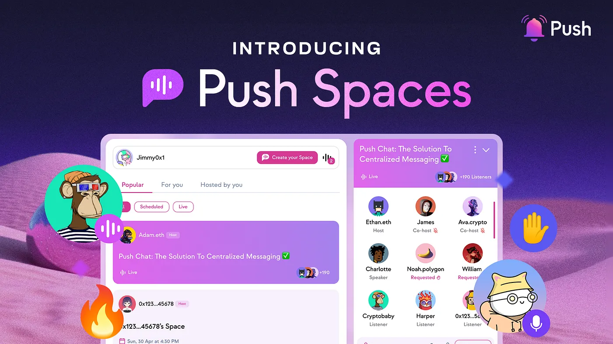

<!--truncate-->

<!--customheaderpoint-->
# Push Spaces is decentralized, incentivized, community-based streaming for the future of online communication.

Today, Push is excited to announce the public launch of Push Spaces! Push Spaces is the first decentralized audio and video streaming application in web3, built on top of Push Protocol’s existing communication ecosystem of 95k subscribers across 700+ applications and 3 ecosystems.

With Push Spaces, we’re continuing to build out the decentralized communication space by providing the internet with an alternative to today’s solutions. Specifically, our solutions have been built to provide a better UX, privacy, censorship-resistance, and community incentives.

Push Spaces is currently available for audio streaming, with video streaming coming soon.

Ready to get started with Push Spaces?[ Start here!](https://push.org/spaces)

Are you a developer wanting to integrate Push Spaces into your dApp? See our developer resources [here.](https://www.npmjs.com/package/@pushprotocol/restapi#for-spaces)

## The Roadmap to Push Spaces
We’ve been [chatting about Push Spaces](https://twitter.com/harshrajat/status/1680123902465306624) for a little while, helping the web3 ecosystem imagine a world of decentralized, community-based streaming. Push Spaces comes on the heels of months of turmoil in the web2 social media space, ranging from corporate discord, censorship risks, and persistent UX pitfalls.

Since its launch in early 2020, Push Protocol (previously EPNS) has been building out the decentralized communication layer for web3, starting with decentralized notifications. Recently, we announced [Push Chat](https://medium.com/push-protocol/announcing-the-push-chat-alpha-launch-f183765ec522), wallet-to-wallet text and video chat. With Push Spaces, we’re continuing to offer applications for developers and users alike, all built off the same multichain communication technology.

## Push Spaces for Users
Push Spaces is designed to intuitively operate like Twitter Spaces. Individuals can browse live and upcoming Push Spaces that are scheduled by individual wallets with host names, subject titles, and event information. Just like Twitter Spaces, you can host or join any open Push Spaces and chat, speak, and react. To host or join a Push Spaces, you need a crypto wallet, and Push is currently compatible with Ethereum, Polygon, BSC wallets. No transaction signature or gas/fee payment is needed to use Push Spaces.

However, a “decentralized Twitter Spaces” is only the beginning of the vision for Push Spaces. As an open source protocol, Push invites developers to innovate on new ways to envision how audio and video streaming can look, including token-gated Spaces for community members.

## Push Spaces for Developers
The Push Spaces app is live for the earliest version of audio streaming. But that’s only the beginning. We invite all web3 developers to explore how the Push Protocol suite can create a more complete and user-friendly dapp experience. Think about an application that delivers personalized notifications to users’ wallets, allows them to chat with customer support through decentralized chat, and keeps the community updated through regular decentralized Spaces — all done seamlessly, permissionlessly, and from the same verifiable wallets.

Join the community of developers already building on Push Protocol, and get started with Push Spaces — [start here!](https://push.org/spaces)

<iframe width="100%" height="382" src="https://www.youtube.com/embed/QK6wx1wJ66A" title="Push Spaces is Live! ✨" frameborder="0" allow="accelerometer; autoplay; clipboard-write; encrypted-media; gyroscope; picture-in-picture; web-share" allowfullscreen></iframe>

