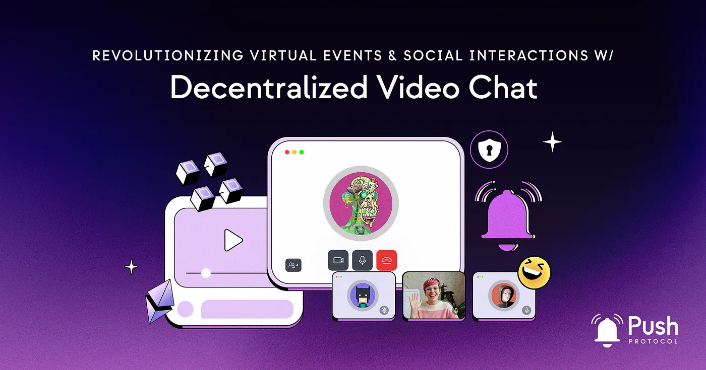

<!--truncate-->

<!--customheaderpoint-->
# 
    Bringing conventional web2 interaction channels to web3.

Virtual events have become a cornerstone of modern communication, enabling people from around the world to connect and engage in a wide range of activities. However, traditional virtual event technologies often come with limitations that hinder the full potential of these experiences. With the emergence of Web3 and the power of decentralized technologies, there’s an opportunity to transform virtual events into more immersive, secure, and interactive experiences.

## The Current Landscape of Virtual Events Technology
Virtual events leverage various web technologies to enable remote participation and create interactive event experiences. These technologies typically include:

1. <b>Live Streaming</b>: Virtual events utilize live streaming technologies to broadcast real-time audio and video content to participants. Platforms leverage protocols like WebRTC (Web Real-Time Communication) and adaptive streaming techniques to ensure high-quality streaming experiences.
2. <b>Video Conferencing</b>: Video conferencing solutions enable real-time communication and interaction among event participants. These solutions incorporate features like video and audio calls, screen sharing, and chat functionalities to facilitate communication and collaboration during virtual events.
3. <b>Content Sharing Platforms</b>: Virtual events often involve the sharing of multimedia content such as presentations, documents, and videos. Content sharing platforms enable organizers to upload and distribute content to participants, ensuring seamless access to event materials.
4. <b>Web-based Access</b>: Virtual events are typically accessed through web browsers, allowing participants to join the event from any device with internet connectivity. Web technologies like HTML, CSS, and JavaScript enable the creation of user interfaces, interactive elements, and responsive design, ensuring compatibility across different devices and operating systems.

Today, virtual events primarily rely on centralized platforms and technologies that come with their own set of challenges. However, these centralized platforms face challenges that hinder their full potential. Decentralized video chat, on the other hand, provides a viable solution to these challenges.

## Enabling the Web3 Transition in Virtual Events
Decentralized video chat functionality stands out as a specialized component that addresses these limitations and offers unique advantages within the virtual events landscape. By combining elements of live streaming, video conferencing, and web-based access, Push Protocol’s video chat introduces groundbreaking features and capabilities that propel virtual events into the realm of Web3 innovation. Here’s why:

## Seamless Integration with Web3 Technologies
Push Video Chat seamlessly integrates with other Web3 technologies such as NFTs, DeFi applications, and on-chain voting systems. This integration enhances the overall virtual event experience and opens up new possibilities for engagement and participation.

## Privacy-First Approach
Push Video Chat prioritizes user privacy by enabling participants to remain anonymous and protect their location information. The use of blockchain technology ensures secure and decentralized data management, minimizing the risk of data breaches or misuse.

## Customization and Scalability
With Push Video Chat, developers have the freedom to create unique and interactive virtual event experiences tailored to their audience. These platforms leverage the scalability of blockchain technology to accommodate large-scale events without compromising performance or user experience.

## Community Engagement and Interactivity
Push Video Chat facilitates real-time audience interaction, empowering participants to actively engage with speakers, ask questions, and collaborate with other attendees. This high level of interactivity fosters a sense of community and promotes meaningful connections within the virtual event space.

## Enhancing Virtual Events with Push Video Chat
By promoting the use of decentralized video chat and distributed communication infrastructure, we can empower event organizers, developers, and participants to create more engaging, secure, and inclusive virtual experiences. By integrating Push Protocol and decentralized video chat into mainstream event platforms, we can foster the widespread adoption of Web3 technologies in virtual events and social interactions.

Push Video Chat offers a wide range of possibilities for enhancing virtual events. Here are a few examples of how it can be utilized:

1. <b>Interactive Q&A Sessions</b>: Facilitate real-time interactions between speakers and attendees, allowing participants to ask questions and engage in 2.meaningful discussions through decentralized video chat.
2. <b>Gamification and Rewards</b>: Integrate gaming elements and Web3-based rewards into virtual events, incentivizing participation and providing unique experiences for attendees.
3. <b>Seamless Integration with Web3 Use Cases</b>: Incorporate features like Proof of Attendance Protocol (POAP) tokens or NFT-based event access to enhance engagement and provide verifiable proof of participation.
4. <b>Decentralized Decision-Making</b>: Enable on-chain voting systems during virtual events to promote transparency, community involvement, and decentralized decision-making.
5. <b>Web3 Sponsorships and Advertisements</b>: Utilize Web3 technologies in event sponsorships, such as offering NFTs or DeFi tokens as rewards, fostering brand engagement and promotion.

## Conclusion
Push Protocol’s video chat functionality offers a sophisticated solution that transcends traditional platforms. Its decentralized architecture ensures privacy, security, and scalability, empowering organizers and participants to create immersive and customizable experiences.

Embrace the power of Web3 technology and Push Protocol’s video chat to shape the future of virtual events, unlocking new dimensions of connection, collaboration, and intellectual exploration. Together, we redefine the boundaries of innovation and inspire a new era of transformative virtual experiences.

### About Push Protocol

Push is the communication protocol of web3. Push protocol enables cross-chain notifications and messaging for dapps, wallets, and services tied to wallet addresses in an open, gasless, and platform-agnostic fashion. The open communication layer allows any crypto wallet /frontend to tap into the network and get the communication across.

To keep up-to-date with Push Protocol: [Website](https://push.org/), [Twitter](https://twitter.com/pushprotocol), [Telegram](https://t.me/epnsproject), [Discord](https://discord.gg/pushprotocol), [YouTube](https://www.youtube.com/c/EthereumPushNotificationService), and [Linktree](https://linktr.ee/pushprotocol).