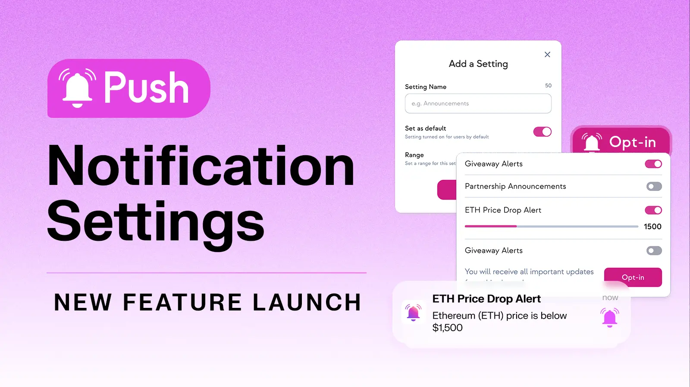
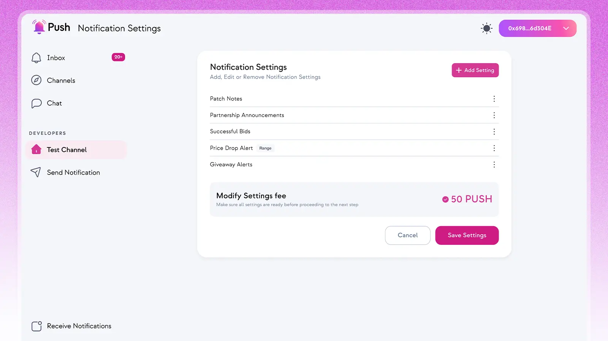
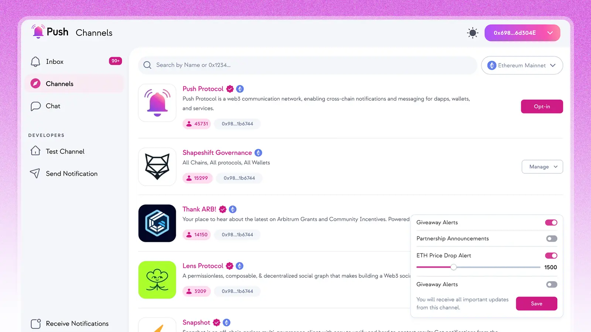
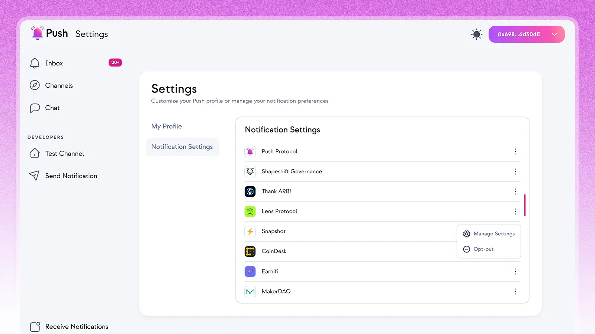

import { ImageText } from '@site/src/css/SharedStyling';

<!--truncate-->

We are extremely excited to be releasing a long-awaited feature - Notification Settings!

This new feature enables both channels and users to customize the type of notifications they send and receive respectively. 

Whether it's specifying which categories of articles on Coindesk you want to receive notifications for or setting alerts for when the price of ETH passes $2,000 – a world of customization and personalization is now available for how you stay up-to-date in web3.

You can browse available channels to opt-in to here in the Push dApp 👉https://app.push.org/channels

In this article we’ll explore:
- Why Notification Settings are important
- How Notification Settings work for Channel Owners
- What the UI/UX looks like for Channel Subscribers
Let’s dive in.

### Why Notification Settings?
Since the launch of v1 of Push smart contracts, we’ve strived to leverage communication tools to help dApps deliver the most user-friendly and sticky user experience possible.

While we’ve always given dApps the ability to create ‘channels’ that users can subscribe to, segmenting different kinds of notifications for different users has always remained a challenge. 

With Notification Settings, we’re now solving this long standing pain point to create an unparalleled level of customization and control for users. Channel Owners now have the ability to segment and categorize different notifications and Channel Subscribers now have the ability to select notifications that match their preferences.

Just as you might customize notifications through “Advanced Notifications Settings” on your favorite web2 mobile apps, Notification Settings through Push brings a similar level of personalization to web3-native subscribers.

So, how do Notification Settings work for both Channel Owners and Channel Subscribers? We’ll walk you through everything there is to know.

### Notification Settings for Channel Owners
Push is a thriving community with hundreds of diverse channels spanning DeFi, gaming, web3 media, and beyond. These channels often have a wide range of content, notifications, and updates to share with their users. 

For example, a DeFi channel might want to send various notifications like loan liquidation alerts, price alerts, or governance proposal notifications. Just as a newsletter might want to send notifications for new articles in its blog, but wouldn’t want to send every article to every subscriber. 

With Notification Settings, Channel Owners can now define specific categories for their notifications. Consequently, when a channel triggers a notification for that specific category, only the users who've opted for that preference will receive a notification.

There are two types of channel settings for Channel Owners:

1. True/False Notification Settings: The first channel setting lets you set up a channel with a simple true/false trigger setting. For instance, say your channel covers web3 news. You can define settings for categories of articles like  "tech" and “partnership announcements” and give users the option to turn each On (true) or Off (false). Adding one of these Notification Settings for every content category gives end-users the option to opt-in for content categories that match their preferences and avoid ones that don’t. 
2. Range Value Notification Settings: The second channel setting lets you set up a range of values for a specific category that might trigger a notification. For instance, say you want to set up a Notification Setting that triggers when the price of ETH passes a given value. You can simply create a range, say from 0-10,000 and subscribers will be able to select any value within that range to set their custom ETH price notification.
You can set as many or as few Notification Settings for your channel as you like. 
Here’s how it looks.

<ImageText><b>Caption:</b> This channel has 5 Notification Settings. 4 of which are True/False Notification Settings and 1 of which is a Range Value Notification Setting. As such, end-users will have the choice to toggle on/off preferences for each of these 5 notifications separately.</ImageText>

Note, each channel will also set a ‘default value’ setting. This ensures subscribers who opt-in without specifying their preferences will simply receive notifications based on the channel's default settings.

For builders looking to integrate Notification Settings, you can find all the relevant and associated documentation here 

👉 https://push.org/docs/notifications/build/create-channel-settings/

### Notification Settings for Channel Subscribers
Empowering Channel Subscribers (end-users) to personalize their notifications is a massive step towards a more user-centric and user-friendly web3 experience. Channel Subscribers can filter out notifications they aren't interested in receiving to reduce notification clutter. This optimizes user inboxes, reduces spam, and helps personalize the user experience.

Here’s how it works for Channel Subscribers:
1. When you subscribe to a channel that has enabled Notification Settings, you’ll have the option to personalize your notification preferences based on the available settings the Channel Owner has preset. 
The choice to customize is optional. You can always opt-in for the ‘default values’ of a channel (these ‘default value’ notifications are determined by the Channel Owner).
Once you’ve selected your preferences for all of the Notification Settings, you can click ‘opt-in’ to initiate the subscription and begin receiving notifications!
This is how the UI will prompt you to select your choice of notification for the channel:

<ImageText><b>Caption:</b> For this channel, there are 4 available Notification Settings to pick from. 3 settings correspond to simple on-off toggles and 1 corresponds to a range value. For this range value setting, you can set any value (price) that you want to receive notifications for within that range.</ImageText>

2. You can review all the channels you are receiving notifications for and manage those settings directly within your “Notification Settings” tab. This dashboard gives you a complete birds-eye-view of all your notifications and lets you edit and change your settings any time at no cost.

Here are a few popular channels to get you started!
- [Push Protocol](http://app.push.org/channels?channel=0xB88460Bb2696CAb9D66013A05dFF29a28330689D)
- [BTC Price Tracker](http://app.push.org/channels?channel=0x03EAAAa48ea78d1E66eA3458364d553AD981871E)
- [ETH Price Tracker](http://app.push.org/channels?channel=0xDBc5936E4daaE94F415C39D284f6a69c4d553F2F)

Full list of Push channels 👉https://app.push.org/channels

Here’s a full demo on how to both setup and sign up for Notification Settings:

<iframe width="100%" height="384" src="https://www.youtube.com/embed/XDJFnfzVxsQ" title="Introducing Notification Settings: Customize Your Web3 Notifications🔔⚙️" frameborder="0" allow="accelerometer; autoplay; clipboard-write; encrypted-media; gyroscope; picture-in-picture; web-share" allowfullscreen></iframe>

### Pushing Personalized Communication Experiences

Notification Settings is a game-changer.

For Channel Owners that want to provide the best level of control and personalization for their users, Notification Settings mean being able to now categorize notifications and updates to only give users information they want.

For Channel Subscribers that want a personalized and engaging user experience, Notification Settings mean being able to accommodate their personal preferences.
At Push, we’re constantly reaffirming our commitment to decentralizing communication and onboarding the next one billion users to web3. As such, we’re looking to build upon Notification Settings and release more communication personalization features soon.

Stay tuned because the best is yet to come.

### About Push Protocol

Push is the communication protocol of web3. Push protocol enables cross-chain notifications and messaging for dapps, wallets, and services tied to wallet addresses in an open, gasless, and platform-agnostic fashion. The open communication layer allows any crypto wallet /frontend to tap into the network and get the communication across.

To keep up-to-date with Push Protocol: [Website](https://push.org/), [Twitter](https://twitter.com/pushprotocol), [Telegram](https://t.me/epnsproject), [Discord](https://discord.gg/pushprotocol), [YouTube](https://www.youtube.com/c/EthereumPushNotificationService), and [Linktree](https://linktr.ee/pushprotocol).

