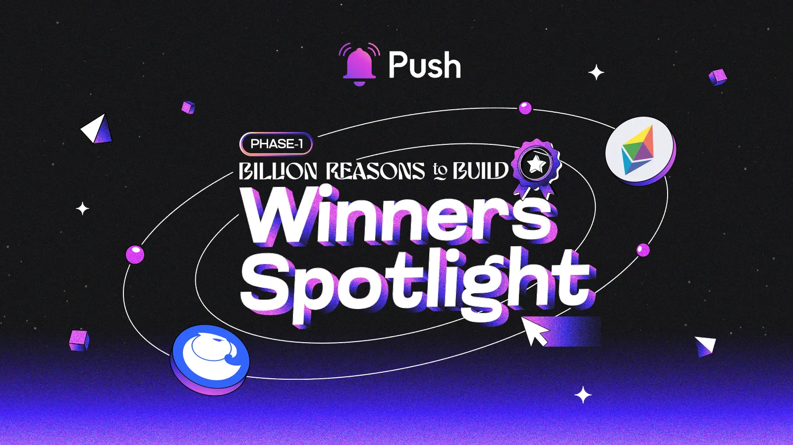

<!--truncate-->

In August last year, we started an exciting journey with the [launch](https://push.org/blog/a-billion-reasons-to-build-finding-india-s-best-web3-developers/) of our Billion Reasons to Build (BRB) developer tour across India. The mission of the campaign was simple – to provide developers the opportunity to create real-world impact by giving them a hard problem to solve from leading protocols. This of course included rewards.

To create a variety of challenges, we teamed up with 12 of the most prominent protocols in web3 including Ethereum Foundation, ETHGlobal, Polygon, Filecoin, The Graph, Aragon, Timeswap, Alchemy, Shardeum, Flipkart, Biconomy, and Chainsafe to create a running hackathon. 

Each partner in the BRB hackathon presented their own unique Coding Challenge – a complex problem with a substantial bounty for the builder who could solve it. 

Today, we're thrilled to announce that 2 of these Coding Challenges have been solved! 

Here are the 2 challenges, the importance behind each of them, and the masterminds behind the game-changing solutions.

### Quantum-proofing Ethereum Network – solved by Aditya Bisht

Coding Challenge Owner: [Ethereum Foundation](https://ethereum.foundation/)

Challenge: Figure out a way to quantum-proof the Ethereum Network, read more [here](https://www.notion.so/pushprotocol/Ethereum-Foundation-07179dcf7f7e44efb7d2b2c9d2296264?pvs=4)

Winning Builder: [Aditya Bisht](https://twitter.com/bisht__13) 

Quantum computing is a looming threat to blockchain networks. Its powerful computing capabilities mean it can be used to reverse-engineer secret keys from public keys. To retain security and integrity in the Ethereum Network, the challenge was presented to find a way to quantum-proof the network using account abstraction.

We’d like to congratulate <b>Aditya Bisht</b> for successfully solving the challenge and contributing to the security and robustness of the Ethereum Network.

He shared his excitement with us – “Faced with intriguing complexities and the convergence of overlapping domains, the challenge not only pushed the boundaries but also contributed to advancing the ZK domain. Immense gratitude to the mentors from the Ethereum foundation and the unwavering support from Push. This victory is a testament to the collaborative spirit propelling the Ethereum project forward.” – Aditya

### All-new DAO Permissions – solved by Samuel Mens

Coding Challenge Owner: [Aragon](https://aragon.org/)

Challenge: Create a permission management protocol for allocating selective permissions to specific individuals and subDAOs, read more [here](https://www.notion.so/pushprotocol/Aragon-f5467edc3c2a4f8d9d5693a0a6e680de?pvs=4).

Winning Builder: [Samuel Mens](http://@plopmenz)

DAOs and organizations rely on being able to give certain permissions, roles, and responsibilities to specific individuals and teams (subDAOs) in order to build more efficiently. But keeping track of which wallets have which permissions can be confusing, not to mention how easy it is to lose track of these permissions across a single DAO. As such, the problem statement required a builder to find a way that enables a DAO to efficiently manage permissions.

With that, we’d like to congratulate Samuel Mens who built two plugins and a UI that allow you to manage both subDAOs and NFT-based permissions using [@hatsprotocol](https://twitter.com/hatsprotocol) and Aragon OSx. For all DAOs that are built using Aragon, there is now a whole new level of on-chain governance management tools available. 

<blockquote>
    <i>
    "I've been part of the Aragon community since their launch of OSx and have built several plugins. I had this idea for a pretty ambitious plugin, which alligned very well with the BRB Hackathon bounty. I am very grateful for Push Protocol for providing this opportunity, giving me the motivation to actually built it and go the extra mile."
    </i>
    

    – Samuel Mens
    

 </blockquote>

### Meet the winners on Jan 16th

We’re excited to host a Twitter Space on Jan 16th, 3PM UTC to talk to our partners and winners of the phase-1 and learn more about their journey and experiences. Don’t forget to join us for the [Twitter Space](https://twitter.com/i/spaces/1lPKqbWRgvEGb).

### BRB Goes Online With 9 Challenges Still Available To Solve 

Thanks to the incredible success of the BRB so far, we are excited to announce the extension of the initiative. We’re calling it <b>BRB Online</b>. This online campaign will mean the BRB Coding Challenges will continue to run indefinitely until solved, allowing more developers worldwide to build for and collaborate with leading web3 projects.

Be sure to check out the remaining Coding Challenges here 👉https://push.org/brb/

Richa Joshi, Co-founder at Push Protocol, shared her excitement: 
<blockquote><i>“The success of BRB has inspired us to take the initiative online. Developers worldwide can now continually access BRB challenges and collaborate directly with some of web3’s leading projects.”</i></blockquote>

We are extremely proud to support the BRB winners and look forward to announcing the winners of all the remaining partner challenges. The journey continues, and we are eager to witness the success and growth of the BRB initiative, shaping a future marked by collaboration, innovation, and possibilities.

