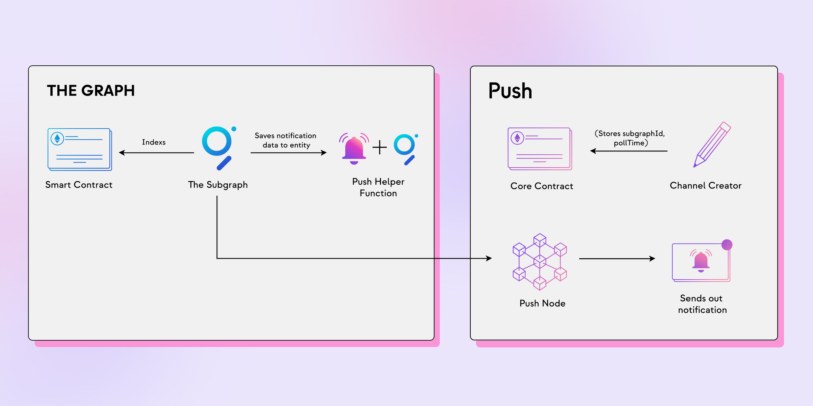
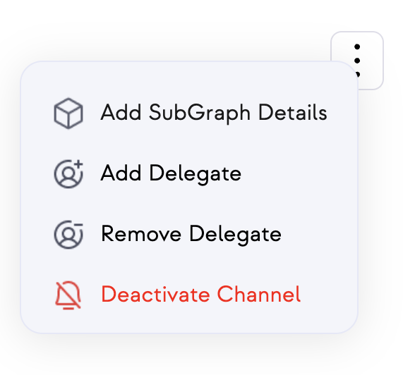
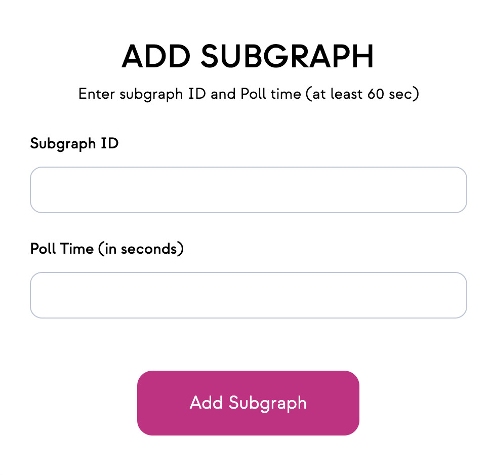

import Tabs from '@theme/Tabs';
import TabItem from '@theme/TabItem';

# Using Subgraph (Gasless)

## Introduction: The Graph Protocol **&** Subgraphs

**The Graph** is a decentralized protocol for indexing and querying data from blockchains, starting with Ethereum. It makes it possible to query data that is difficult to query directly.

A **Subgraph** defines which data **The Graph** will index from a blockchain, and how it will store it. Once deployed, it will form a part of a global graph of blockchain data which you can retrieve using GraphQL.

Currently, Push only supports the subgraphs deployed on **Hosted Service of The Graph Protocol**. Providing support to Subgraph Studio would be part of the next iteration.

For more information on how to deploy a subgraph on the hosted service for your smart contract or dApp, check out [this documentation](https://thegraph.com/docs/en/hosted-service/deploy-subgraph-hosted/).

## Notifications from Subgraphs 💡

Subgraphs retrieve and store data from the blockchain for a particular smart contract. This data can be used to analyze a variety of things related to the smart contract.

For example, the [**Uniswap Subgraph**](https://thegraph.com/hosted-service/subgraph/uniswap/uniswap-v2) stores data related to the total volume across all trading pairs, volume data per trading pair, and even data for a particular token.

**What if you intelligently fetch the data from a Subgraph and generate useful alerts 🤔?**

This will be extremely helpful for the end-users of your dApp and entities connected to your smart contract making the user experience smoother.

## Sending Notifications using Push

Push protocol has developed an in-house `Helper Function` specifically for The Graph Protocol which allows you to read events from the Subgraph and define notifications accordingly. Once defined, they will be stored on the Subgraph in a `Long String` format.

Push Nodes can, later on, fetch the notifications defined on a Subgraph and push them accordingly to Subscribers of the Channel.



## Push X Graph Integration through an Example

### Example

Integrate Push Protocol with an ERC-20 contract's subgraph **to send out notifications whenever a Transfer happens**.

### Pre-requisites

1. Have a Push Notification Channel ready - see the docs [here](https://docs.epns.io/developers/developer-zone/create-your-notif-channel) to create a channel
2. Install the **graph CLI**

```mdx-code-block
<Tabs
    defaultValue="npm"
    values={[
        {label: 'npm', value: 'npm'},
        {label: 'yarn', value: 'yarn'},
    ]}>
<TabItem value="npm">
```

```bash
npm install -g @graphprotocol/graph-cli
```

```mdx-code-block
</TabItem>
<TabItem value="yarn">
```

```bash
yarn global add @graphprotocol/graph-cli
```

```mdx-code-block
</TabItem>
</Tabs>
```

3\. Link your Github to The Graph's hosted service -[https://thegraph.com/hosted-service/](https://thegraph.com/hosted-service/)

4\. Add a subgraph named XXXX from your Hosted Service Dashboard -[https://thegraph.com/hosted-service/dashboard](https://thegraph.com/hosted-service/dashboard)

### **Contract deployment**

:::caution
Skip this step if you a have deployed contract already that you want to query
:::

1. Copy the ERC-20 contract - [https://github.com/aiswaryawalter/push-graph-notification/blob/main/contracts/PushToken.sol](https://github.com/aiswaryawalter/push-graph-notification/blob/main/contracts/PushToken.sol)
2. Deploy on the Goerli Test Network using the Remix IDE - [https://remix.ethereum.org/](https://remix.ethereum.org/\*\*)

### **Subgraph deployment**

:::caution
Skip this step if you already have a deployed subgraph
:::

1. Clone the ERC-20 token subgraph - [https://github.com/aiswaryawalter/push-graph-notification](https://github.com/aiswaryawalter/push-graph-notification)
2. In `subgraph.yaml` update the contract address to the one you just deployed
3.  Install packages

    ```bash
    yarn install
    ```
4.  Generate code

    ```bash
    graph codegen && graph build
    ```
5.  Get the access token from the Graph dashboard & authenticate

    ```bash
    graph auth --product hosted-service <ACCESS_TOKEN>
    ```
6.  Deploy the subgraph and check on the Graph dashboard whether the&#x20;

    ```bash
    graph deploy --product hosted-service <GITHUB_USERNAME>/<SUBGRAPH_NAME>
    ```

### Integrate Push to the Subgraph

1.  Navigate to the Subgraph directory and you’ll find `schema.graphql` file. Open in an editor of your choice and include the following Push Schema:

    ```typescript
    type EpnsNotificationCounter @entity {
      id: ID!
      totalCount: BigInt!
    }

    type EpnsPushNotification @entity {
      id: ID!
      notificationNumber: BigInt!
      recipient: String!
      notification: String!
    }
    ```
2.  In the mappings file under `src/`export the subgraph ID

    ```typescript
    //Note: Push Protocol supports only The Graph Hosted Service at present

    export const subgraphID = "<GITHUB_USERNAME>/<SUBGRAPH_NAME>" 

    //example
    //export const subgraphID = "aiswaryawalter/push-graph-test"
    ```

:::info
_Note: Make sure the above step is complete, as Subgraph ID will be imported in the next step!_
:::

3.  Create a file named `PushNotification.ts` in the `src/` folder. We’ll call this our Helper File. Now, copy the below-provided TypeScript code and paste it into the newly created Helper file:

    ```typescript
    import { BigInt,log } from "@graphprotocol/graph-ts"
    import { EpnsNotificationCounter, EpnsPushNotification } from '../generated/schema'
    import { subgraphID } from "./push-token"

    export function sendPushNotification(recipient: string, notification: string): void 
    {
      let id1 = subgraphID
      log.info('New id of EpnsNotificationCounter is: {}', [id1])
      let epnsNotificationCounter = EpnsNotificationCounter.load(id1)
      if (epnsNotificationCounter == null) {
        epnsNotificationCounter = new EpnsNotificationCounter(id1)
        epnsNotificationCounter.totalCount = BigInt.fromI32(0)
      }
      epnsNotificationCounter.totalCount = (epnsNotificationCounter.totalCount).plus(BigInt.fromI32(1))

      let count = epnsNotificationCounter.totalCount.toHexString()
      let id2 = `${subgraphID}+${count}`
      log.info('New id of EpnsPushNotification is: {}', [id2])
      let epnsPushNotification = EpnsPushNotification.load(id2)
      if (epnsPushNotification == null) {
        epnsPushNotification = new EpnsPushNotification(id2)
      }
      epnsPushNotification.recipient = recipient
      epnsPushNotification.notification = notification
      epnsPushNotification.notificationNumber = epnsNotificationCounter.totalCount
      epnsPushNotification.save()
      epnsNotificationCounter.save()
    }
    ```
4.  Import the helper function in the mappings file

    ```typescript
    import { sendPushNotification } from "./PushNotification"
    ```

:::info
Follow steps 5, 6 and 7 within the respective handler functions from which the notification needs to be sent👇🏼
:::

5.  **Define Notification Payload Items:** In the event handler mapping from which you need to send the notification, define the notification payload items such as recipient of the notification, type, title, message, etc. These variables will be further used to define the notification variable.
    
    It’s highly recommended to take a look at [this documentation](https://docs.epns.io/developers/developer-zone/sending-notifications/advanced/notification-payload-types) to understand more about payload items and their definitions.


    For a quick reference, the `recipient` differs with the payload type. For example, **broadcast** (type = 1) and special multi-payload notifications have the **channel address** as the `recipient`.


    ```typescript
      let recipient = event.params.to.toHexString(),
      type = "3",
      title = "PUSH Received",
      body = `Received ${event.params.tokens.div(power)} PUSH from ${event.params.from.toHexString()}`,
      subject = "PUSH Received",
      message = `Received ${event.params.tokens.div(power)} PUSH from ${event.params.from.toHexString()}`,
      image = "https://play-lh.googleusercontent.com/i911_wMmFilaAAOTLvlQJZMXoxBF34BMSzRmascHezvurtslYUgOHamxgEnMXTklsF-S",
      secret = "null",
      cta = "https://epns.io/"

    ```
6.  **Define Notification:**
    The `notification` variable is defined in the given below format 👇🏼
    
    **Format : `{"field1" : "value1", "field2" : "value2" }`**

    ```typescript
    let notification = `{\"type\": \"${type}\", \"title\": \"${title}\", \"body\": \"${body}\", \"subject\": \"${subject}\", \"message\": \"${message}\", \"image\": \"${image}\", \"secret\": \"${secret}\", \"cta\": \"${cta}\"}`
    ```
7.  **Call the Push Helper Function:** Once the above steps are complete, we need to invoke the Push helper function and send the response. To call the Push Notification helper function, use the below script;


    ```typescript
    sendPushNotification (recipient, notification)
    ```

### Redeploy Subgraph

1.  Generate code

    ```jsx
    graph codegen
    ```
2.  Get the access token from the Graph dashboard & authenticate

    ```jsx
    graph auth --product hosted-service <ACCESS_TOKEN>
    ```
3.  Deploy the subgraph

    ```bash
    graph deploy --product hosted-service <GITHUB_USER>/<SUBGRAPH NAME>
    ```
4.  In the subgraph playground, paste the below **query** & show the notification payloads

    ```jsx
    {
        epnsPushNotifications(first: 20) {
            id
            notificationNumber
            recipient
            notification
        }
    }
    ```


Here is the final subgraph with Push integration - [https://github.com/aiswaryawalter/push-graph-notification](https://github.com/aiswaryawalter/push-graph-notification)

### Alright! Let's Add Subgraph to Push Notification Channel

Once you have set up Push integration into your subgraph, you must add the subgraph to its notification channel in order to deliver notifications. You will require the **Subgraph ID** for this purpose.

It is a slug usually present at the end of the subgraph URL 😉

```atom
https://thegraph.com/hosted-service/subgraph/aiswaryawalter/push-graph-test
```

If you are a **Channel Owner**, follow the below steps;

1. Go to **Push Dapp** ([https://staging.push.org/](https://staging.push.org/)) → Channel Dashboard → Add Subgraph Details
2. Enter your `Subgraph ID` and `Poll Interval`

Poll Interval (in seconds) defines the time period at which Push Nodes shall ping the subgraph for fetching the latest notifications.

**Note:** _This is an on-chain transaction that stores the above data to **Push Core Contract.** So it requires $ETH for gas fees._

> _If you don’t have a channel yet, you can easily create one by following this guide_ [_here_](https://docs.epns.io/developers/developer-zone/create-your-notif-channel)_._

<div>



 


</div>

### **Testing Notification**

1. &#x20;`Opt-in` to the newly created channel
2. Initiate a `Transfer` &#x20;
3. Wait for the notification to appear on the recipient's wallet via Push dApp, Mobile App, Browser Extension

🎉 Congratulations on successfully integrating Push Helper Function into your Subgraph, and also adding Subgraph details into your channel.

Once done, **Push Nodes** will fetch the subgraph info from the Core Contract and start polling the respective subgraph for notifications at regular Poll Intervals.
